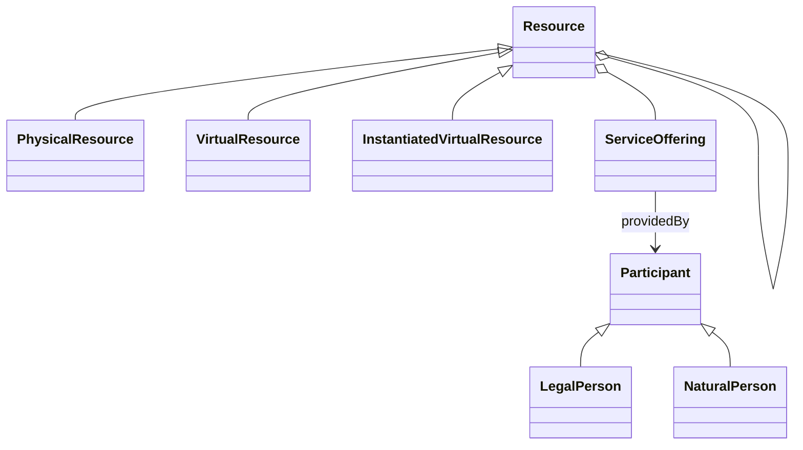
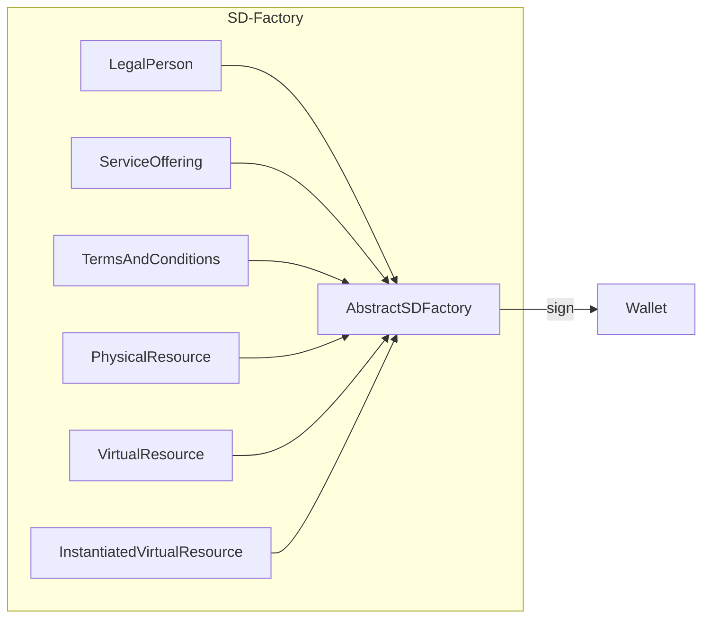
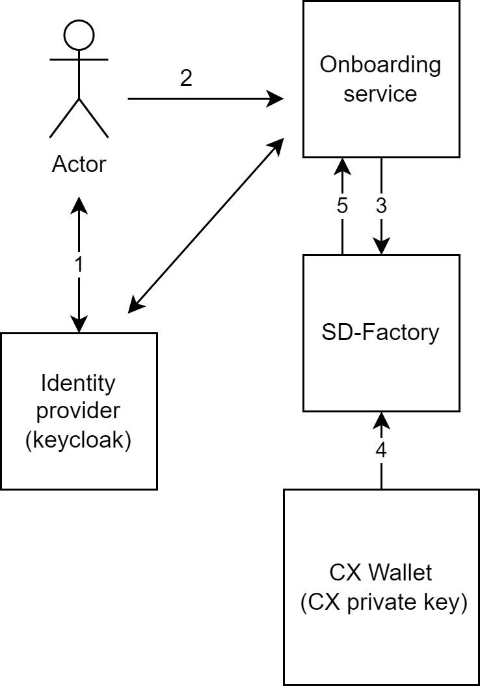

# Arc 42 Self Description Factory

## Introduction and Goals

SD-Factory creates a Verifiable Credential based on the information taken from OS, unlocks Private Key from CX-wallet 
and signs it with CatenaX key.

The self description factory is a factory to create Self Descriptions for each entity of GAIA-X TrustFramework.  
This page describes the context based on 
[TrustFramework v.22.04](https://gitlab.com/gaia-x/policy-rules-committee/trust-framework/-/tree/22.04)

## Requirements Overview

### High Level Requirements for Release 1


*   Create Self-Descriptions formed on information from the Onboarding Service
*   Unlock a Private Key from CX-Wallet
*   Sign Self-Description with CatenaX key

### High Level Requirement for Release 2

*   Creation of LegalPerson for each company
*   Creation of PhysicalResource for the place where the service (e.g. connector) will running
*   Creation of Service Offering and InstantiatedVirtualResource for each connector
*   Provide API interface exclusively for the Portal
*   Provide signed SD document
*   Store SD documents

### High Level Requirements for Release 3

*   validate compliance of created SD documents using GX Compliance Service
*   Trust-Anchor of wallet is an eiDAS trust anchor

### Non-functional requirements

*   The SD Factory will have to be: accessible, easy to use, secure, efficient etc.

### Quality Goals

| Priority | Quality-Goal | Scenario                                                                                       |
|----------|--------------|------------------------------------------------------------------------------------------------|
| 1        | Security     | Protecting API against unauthorized access. Protecting the Keys.                               |
| 1        | Integrity    | Authorized recipients/Users can not Delete and add SD-Document from/for other recipients/users |
| 2        | Reliability  | The microservices are available 99.9999%.                                                      |
| 2        | Ease-of-use  | The SD-Factory will provide ease-of-use API                                                    |

## Architecture Constraints

### Self Description Data Model

The data model of Gaia-X is not finally defined yet, but is a livid document with permanent changes. The latest 
information are available [here](https://gaia-x.gitlab.io/policy-rules-committee/trust-framework/participant/#provider).
Therefore, it was aligned with Gaia-X that the Self Descriptions' claims contain a small set of properties such as

Version 0.1 (October 2021 as mentioned in a Workshop together with Pierre Gronlier)

*   service\_name: the service provider (Operating Company)
*   service\_provider: the service provider (Operating Company) 
*   product\_provider: the product provider (the company providing this service): For shared services this will be Catena-X or the operating company in the name of Catena-x. 
*   governance\_law\_country: the service provider

Version 1.0 (based on the [Trust-Framework](https://gaia-x.gitlab.io/policy-rules-committee/trust-framework/participant/#provider))

* company\_number: Country’s registration number which identify one specific company.
* headquarter.country: Physical location in [ISO 3166-1](https://www.iso.org/iso-3166-country-codes.html)
  alpha2, alpha-3 or numeric format.
* legal.country: Legal location in [ISO 3166-1](https://www.iso.org/iso-3166-country-codes.html)
  alpha2, alpha-3 or numeric format.
* service.provider: a `provider`‘s URL which provide the service
* bpn: the business partner id

For Catena-X release 2.0 we aligned with GAIA-X to adhere to
[Trustframework v22.04](https://confluence.catena-x.net/download/attachments/25223149/Gaia-X-Trust-Framework-22.04.pdf?version=1&modificationDate=1658315527264&api=v2), 
thus providing self descriptions for

*   Legal person
*   Service offering
*   Data exchange connector service

**LegalPerson**

* **registrationNumber**: Country’s registration number which identify one specific company.
* **headquarterAddress.country**: Physical location in [ISO 3166-1](https://www.iso.org/iso-3166-country-codes.html)
  alpha2, alpha-3 or numeric format.
* **legalAddress.country**: Legal location in [ISO 3166-1](https://www.iso.org/iso-3166-country-codes.html)
  alpha2, alpha-3 or numeric format.

additional attributes for Catena-X purpose

*   bpn: the business partner id

**ServiceOffering**

* **providedBy:** a resolvable link to the participant self-description providing the service (see SD LegalPerson)
* **termsAndConditions**: a resolvable link to the Terms and Conditions applying to that service
* **policies**: a list of policy expressed using a DSL (Rego or ODRL)
* **aggregationOf:** (optional) a resolvable link to the resources self descriptions related to the service and that
  can exist independently of it.

**TermsAndConditions structure**

*   URL: a resolvable link to the document
*   hash: sha256 hash of the above document

### GX-Compliance Service

GAIA-X will also provide a service to proof for compliant self descriptions 
([https://gitlab.com/gaia-x/lab/compliance/gx-compliance](https://gitlab.com/gaia-x/lab/compliance/gx-compliance)).


## System Scope and Context

The Portal provides the necessary information to the SD Factory in plain text format via
API. SD-Factory creates the Jason-LD document signed by the wallet and provides it to the 
Portal.

## Business Context


## Technical Context

The following pictures show the relevant conceptual model with the entities of interest. For organizations, we do not
have to consider Natural Persons, but only Legal Persons. Each of these entities does have some mandatory but also some
optional attributes.


  
To get them filled we provide a service factory for each of the entities. Hence we have a subclassing hierarchy. 
The abstract instance provides the general feature to get things signed, either a part of the self-description or 
the whole self-description. In both cases, a string in JSON-LD format is passed to a wallet and gets signed by 
its private key and will be returned as String as signed JSON-LD.



We reduced the mandatory attributes according to 
[TrustFramework v.22.04](https://gitlab.com/gaia-x/policy-rules-committee/trust-framework/-/tree/22.04) 
and needed attributes for Catena-X.

**LegalPerson**

| **Attribute**              | **Cardinality** | **Comment**                                                                              |
|----------------------------|-----------------|------------------------------------------------------------------------------------------|
| registrationNumber         | 1               | Country's registration number which identify one specific company                        |
| headquarterAddress.country | 1               | Physical location of head quarter in ISO 3166-1 alpha2, alpha-3 or numeric format.       |
| legalAddress.country       | 1               | Physical location of legal registration in ISO 3166-1 alpha2, alpha-3 or numeric format. |
| bpn                        | 1               | Catena-X specific attribute representing the business partner number for legals (BPN-L)  |

**ServiceOffering**

| **Attribute**      | **Cardinality** | **Comment**                                                                                                         |
|--------------------|-----------------|---------------------------------------------------------------------------------------------------------------------|
| providedBy         | 1               | a resolvable link to the participant self-description providing the service                                         |
| aggregationOf      | 0..\*           | a resolvable link to the resources self- description related to the service and that can exist independently of it. |
| termsAndConditions | 1..\*           | a resolvable link to the Terms and Conditions appling to that service.                                              |
| policies           | 0..\*           | a list of policy expressed using a DSL (e.g., Rego or ODRL)                                                         |

**TermsOfConditions**

| **Attribute** | **Cardinality** | **Comment**                        |
|---------------|-----------------|------------------------------------|
| URL           | 1               | a resolvable link to document      |
| hash          | 1               | sha256 hash of the above document. |

**PhysicalResource**

| **Attribute**           | **Cardinality** | **Comment**                                                                                                  |
|-------------------------|-----------------|--------------------------------------------------------------------------------------------------------------|
| maintainedBy            | 1..\*           | a list of participant maintaining the resource in operational condition and thus have physical access to it. |
| locationAddress.country | 0..\*           | a list of physical location in ISO 3166-1 alpha2, alpha-3 or numeric format.                                 |

**VirtualResource**

| **Attribute**    | **Cardinality** | **Comment**                                                                                                                                                                                                                                                                                                              |
|------------------|-----------------|--------------------------------------------------------------------------------------------------------------------------------------------------------------------------------------------------------------------------------------------------------------------------------------------------------------------------|
| copyrightOwnedBy | 1..\*           | A list of copyright owner either as a free form string or participant self- description. A copyright owner is a person or organization, that has the right to exploit the resource. Copyright owner does not necessary refer to the author of the resource, who is a natural person and may differ from copyright owner. |
| license          | 1..\*           | A list of SPDX license identifiers or URL to license document                                                                                                                                                                                                                                                            |

**InstantiatedVirtualResource**

| **Attribute** | **Cardinality** | **Comment**                                                             |
|---------------|-----------------|-------------------------------------------------------------------------|
| maintainedBy  | 1..\*           | a list of participant maintaining the resource in operational condition |
| hostedOn      | 1               | a resource where the process is running, being executed on.             |
| tenantOwnedBy | 1..\*           | a list of participant with contractual relation with the resource.      |
| endpoint      | 1..\*           | a list of exposed endpoints as defined in  ISO/IEC TR 23188:2020        |

## Solution Strategy

### The process for creating SD-Documents:

#### Step 1: Creation of LegalPerson for each company
*   Each SME or Company has to have an SD-Document. This SD document has to be created during the onboarding process.
*   It means concretely we have to create the LegalPerson for each company:
    *   SMEs,
    *   Enterprises,
    *   and Third-Party Provider

Example LegalPerson


*   The SD-Document of the company's LegalPerson will be signed by the Catena-X Wallet.

#### Step 2: Creation of PhysicalResource for the place where the service (e.g. connector) will running

* Each service need a data center or cloud ctenant where the service will be deployed this is the Physical 
  resource of the service
* the PhysicalResource contains a list of Participant who maintaining the service and the location (country)

Example PhysicalResource:


The Physical Resource will be created by the operator of the service (connector). The operator will use his wallet 
to sign this SD-Document.

#### Step 3: Creation of Service Offering and InstantiatedVirtualResource for each connector:

*   Pre assumptions:
    *   SD-Document: LegalPerson of connector operator is already existing
    *   SD-Document: PhsicalResource of the Connector is already existing
*   creation of InstantiatedVirtualResource for each connector
*   creation of ServiceOffering for each connector


*   The SD-Document of the connector will be signed by the Company Wallet (e.g. T-Systems wallet).

##REST interface

The Swagger documentation for SD-Factory is available at 
[https://sdfactory.int.demo.catena-x.net/SDFactoryApi.yml](https://sdfactory.int.demo.catena-x.net/SDFactoryApi.yml) as YAML and 
[https://sdfactory.int.demo.catena-x.net/swagger-ui/index.html#/](https://sdfactory.int.demo.catena-x.net/swagger-ui/index.html#/)
in a human-readable format.

Current OpenAPI specification of the service is given bellow:

```yaml
openapi: 3.0.0
info:
  version: 0.0.0
  title: SD-Factory API
  description: API for creating and storing the Verifiable Credentials

paths:
  /selfdescription:
    post:
      summary: Creates a Verifiable Credential and returns it
      operationId: selfdescriptionPost
      requestBody:
        required: true
        description: parameters to generate VC
        content:
          application/json:
            schema:
              oneOf:
                - $ref: '#/components/schemas/LegalPersonSchema'
                - $ref: '#/components/schemas/ServiceOfferingSchema'
              discriminator:
                propertyName: type
                mapping:
                  LegalPerson: '#/components/schemas/LegalPersonSchema'
                  ServiceOffering: '#/components/schemas/ServiceOfferingSchema'
            examples:
              LegalPerson:
                description: payload to create LegalPerson
                value:
                    type: LegalPerson
                    holder: BPNL000000000000
                    issuer: CAXSDUMMYCATENAZZ
                    registrationNumber: o12345678
                    headquarterAddress.country: DE
                    legalAddress.country: DE
                    bpn: BPNL000000000000
              ServiceOffering:
                description: payload to create ServiceOffering
                value:
                  holder: BPNL000000000000
                  issuer: CAXSDUMMYCATENAZZ
                  type: ServiceOffering
                  providedBy: https://participant.url
                  aggregationOf: to be clarified
                  termsAndConditions: to be clarified
                  policies: to be clarified
      responses:
        '201':
          description: Created
          content:
            application/vc+ld+json:
              schema:
                type: object
                additionalProperties: {}
              examples:
                jsonLegalPersonObject:
                  summary: A sample LegalPerson response
                  value: |
                      {
                        "id": "https://sdfactory.int.demo.catena-x.net/selfdescription/vc/1fb3ca5f-234e-4639-8e96-f2ceb56714f0",
                        "@context": [
                          "https://www.w3.org/2018/credentials/v1",
                          "https://raw.githubusercontent.com/catenax-ng/product-sd-hub/eclipse_preparation/src/main/resources/verifiablecredentials.jsonld/sd-document-v0.1.jsonld",
                          "https://w3id.org/vc/status-list/2021/v1"
                        ],
                        "type": [
                          "VerifiableCredential",
                          "LegalPerson"
                        ],
                        "issuer": "did:sov:BEumURwPdXCobgbPYQZXge",
                        "issuanceDate": "2022-10-08T18:12:14Z",
                        "expirationDate": "2023-01-06T18:12:14Z",
                        "credentialSubject": {
                          "headquarter_country": "DE",
                          "legal_country": "DE",
                          "bpn": "BPNL000000000000",
                          "registration_number": "12345678",
                          "id": "did:indy:idunion:test:P5TFvs9PQ6e6nMB18XVTJw"
                        },
                        "credentialStatus": {
                          "id": "https://managed-identity-wallets.int.demo.catena-x.net/api/credentials/status/fe5da20d-35c1-4154-b764-1e7dc875ca1d#61",
                          "type": "StatusList2021Entry",
                          "statusPurpose": "revocation",
                          "statusListIndex": "61",
                          "statusListCredential": "https://managed-identity-wallets.int.demo.catena-x.net/api/credentials/status/fe5da20d-35c1-4154-b764-1e7dc875ca1d"
                        },
                        "proof": {
                          "type": "Ed25519Signature2018",
                          "created": "2022-10-08T18:12:16Z",
                          "proofPurpose": "assertionMethod",
                          "verificationMethod": "did:sov:BEumURwPdXCobgbPYQZXge#key-1",
                          "jws": "eyJhbGciOiAiRWREU0EiLCAiYjY0IjogZmFsc2UsICJjcml0IjogWyJiNjQiXX0..PNxly7b0d714bapo58YB-qmTtw7q3TVB7plOtaQRCXF2VrCwO4-x7Fx8PeavnwYpzu8adF8ZLnALDgMuPBXIAg"
                        }
                      }
                jsonServiceOfferingObject:
                  summary: A sample ServiceOffering response
                  value: |
                      {
                          "@context": [
                              "https://www.w3.org/2018/credentials/v1",
                              "https://raw.githubusercontent.com/catenax-ng/product-sd-hub/eclipse_preparation/src/main/resources/verifiablecredentials.jsonld/sd-document-v0.1.jsonld",
                              "https://w3id.org/vc/status-list/2021/v1"
                          ],
                          "type": [
                              "VerifiableCredential",
                              "ServiceOffering"
                          ],
                          "issuer": "did:sov:BEumURwPdXCobgbPYQZXge",
                          "issuanceDate": "2022-10-08T19:10:20Z",
                          "expirationDate": "2023-01-06T19:10:20Z",
                          "credentialSubject": {
                              "termsAndConditions": "http://terms.and.cond",
                              "policies": "policies",
                              "provided_by": "sss",
                              "id": "did:indy:idunion:test:P5TFvs9PQ6e6nMB18XVTJw"
                          },
                          "credentialStatus": {
                              "id": "https://managed-identity-wallets.int.demo.catena-x.net/api/credentials/status/fe5da20d-35c1-4154-b764-1e7dc875ca1d#67",
                              "type": "StatusList2021Entry",
                              "statusPurpose": "revocation",
                              "statusListIndex": "67",
                              "statusListCredential": "https://managed-identity-wallets.int.demo.catena-x.net/api/credentials/status/fe5da20d-35c1-4154-b764-1e7dc875ca1d"
                          },
                          "proof": {
                              "type": "Ed25519Signature2018",
                              "created": "2022-10-08T19:10:23Z",
                              "proofPurpose": "assertionMethod",
                              "verificationMethod": "did:sov:BEumURwPdXCobgbPYQZXge#key-1",
                              "jws": "eyJhbGciOiAiRWREU0EiLCAiYjY0IjogZmFsc2UsICJjcml0IjogWyJiNjQiXX0..ivUytTwbtcxByw5L2zuxpE4pjJTIEzaLPoW_gXUtByjfN34ViEbgq6KeKO82ejB6GNetzJcu7sqsZfp6-GPzDA"
                          }
                      }
components:
  securitySchemes:
    bearerAuth: # arbitrary name for the security scheme
      type: http
      scheme: bearer
      bearerFormat: JWT    # optional, arbitrary value for documentation purposes
  schemas:
    SelfDescriptionSchema:
      type: object
      properties:
        type:
          type: string
        holder:
          type: string
        issuer:
          type: string
      required:
        - type
        - holder
        - issuer
    LegalPersonSchema:
      type: object
      allOf:
        - $ref: '#/components/schemas/SelfDescriptionSchema'
      properties:
        registrationNumber:
          type: string
        headquarterAddress.country:
          type: string
        legalAddress.country:
          type: string
        bpn:
          type: string
      required:
        - type
        - holder
        - issuer
        - bpn
    ServiceOfferingSchema:
      type: object
      allOf:
        - $ref: '#/components/schemas/SelfDescriptionSchema'
      properties:
        providedBy:
          type: string
          format: uri
        aggregationOf:
          type: string
        termsAndConditions:
          type: string
        policies:
          type: string
      required:
        - type
        - holder
        - issuer
        - providedBy
security:
  - bearerAuth: []
```  

POST /selfdescription

Endpoint consumes JSON data (so, header Content-Type should be application/json) and returns JSON-LD.  
Note: Each request should contain holder and issuer fields and also type field (that is type of document, 
i.e. for LegalPerson it will be LegalPerson).  
  
Sample data for LegalPerson:

    {
      "registrationNumber": "123456",
      "headquarterAddress.country": "DE",
      "legalAddress.country": "DE",
      "bpn": "CAXSDUMMYCATENAZZ",
      "issuer": "CAXSDUMMYCATENAZZ",
      "holder": "CAXSDUMMYCATENAZZ",
      "type": "LegalPerson"
    }


Sample data for ServiceOffering:

    {
      "providedBy": "https://<link_to_participant_self_description>",
      "aggregationOf": "https://<link_to_resource_self_description>",
      "termsAndConditions": "https://<link_to_terms_and_conditions>",
      "issuer": "CAXSDUMMYCATENAZZ",
      "holder": "CAXSDUMMYCATENAZZ",
      "type": "ServiceOffering"
    }
    

##SD-Documents for Release 2:

In agreement with Portal, we will only create the LegalPerson SD-Document for CX-Participants and ServiceOffering for Connector

**CX-Release 2.0 (to be discussed with Portal-Team whether this reduces the amount of work or not for first step)**

> Proof, whether SD-Hub is able to provide a resolvable link to a registered SD artifact, e.g like _**[https://sdhub.catena-x.de/sd?bpn=xyz](https://sdhub.catena-x.de/sd?bpn=xyz)**_
>
> If this is possible, everything is fine and in the dialog this resolvable link had to be provided.
>
> If this is not possible, wenn instead of providing the link, we had to provide the data separated by semicolons for each attribute provided within the linked SD artifact.
>
> Example for this modified linking:
>
> Sample data for ServiceOffering:
> 
> instead of   
> providedBy="_**[https://sdhub.catena-x.de/sd?bpn=xyz](https://sdhub.catena-x.de/sd?bpn=xyz)**_"  
we send  
providedBy="registrationNumber="123456";headquarterAddress.country="DE";legalAddress.country="DE";bpn="CAXSDUMMYCATENAZZ";issuer="CAXSDUMMYCATENAZZ";holder="CAXSDUMMYCATENAZZ""

  
Responses:

| code | description                                      |
|------|--------------------------------------------------|
| 201  | A verifiable Credential was created successfully |
| 401  | Unauthorized                                     |
| 403  | Access is forbidden                              |

##Building Block View


##Runtime View



Here the flow of Self-Description creation is shown:

1. A user is authenticated in Identity Provider service on behalf of a company and receives the authentication ticket.
2. User calls Onboarding Service with request for creating and publishing SD-document. The service authenticates the user
   and prepare the data SD-Factory needs for creating SD-document such as: company\_number, headquarter.country and legal.country.
   **The ID (DID) of the user shall be known at this point of time as SD-document consist of Verifiable Credentials (VC)
   issued for a holder of a DID. This means that the Organisation wallet is already available.** The nature of that ID 
   is not very important for the SD-hub, the only requirement is that it shall be resolvable to a DID document. It can be 
   a regular http URL even.
3. Onboarding service (OS) calls SD-Factory for creating and publishing SD-document passing this data as a parameter.
   OS uses a credential with a role allowing for this request (e.g. ROLE\_SD\_CREATOR). The credential for this operation
   is taken from ID Provider (keyclock).
4. SD-Factory creates a Verifiable Credential based on the information taken from OS, unlocks Private Key from 
   Organisation-wallet (custodian wallet), and signs it with organization key.
5. SD-Factory publishes the Verifiable Credential to the Portal. As the VC is signed with a trusted key the endpoint for
   publishing at the Portal may be publicly accessible. SD document is not stored in SD-Factory.

##Deployment View

In Catena-X we use [ARGO-CD](https://confluence.catena-x.net/display/ARTI/ArgoCD+deployment+tool) for deployment

[README.md](https://github.com/catenax-ng/tx-sd-factory/blob/main/README.md) describe the deployment process

##Quality Requirements

[See Quality Gates 4](https://confluence.catena-x.net/pages/viewpage.action?pageId=55011187&src=contextnavpagetreemode)

##Glossary

| Term                                                                                                     | Description                                                                                                                                                                                                                                                                                                                                                 |
|----------------------------------------------------------------------------------------------------------|-------------------------------------------------------------------------------------------------------------------------------------------------------------------------------------------------------------------------------------------------------------------------------------------------------------------------------------------------------------|
| Gaia-X                                                                                                   | Gaia-X represents the next generation of data infrastructure ecosystem: an open, transparent, and secure digital ecosystem, where data and services can be made available, collated and shared in an environment of trust. ([more](https://gaia-x.eu/sites/default/files/2021-10/Gaia-X%20Factsheet.pdf))                                                   |
| Catalogue                                                                                                | A Catalogue presents a list of available Service Offerings. Catalogues are the main building blocks for the publication and discovery of Self-Descriptions for Service Offerings by the Participants. ([more](https://gaia-x.eu/sites/default/files/2022-01/Gaia-X_Architecture_Document_2112.pdf))                                                         |
| (Catena-X Data Space)                                                                                    | A Data Space is a virtual data integration concept defined as a set of participants and a set of relationships among them, where participants provide their data resources and computing services. ([more](https://gaia-x.eu/sites/default/files/2022-01/Gaia-X_Architecture_Document_2112.pdf))                                                            |
| Catena-X Portal / Onboarding Process                                                                     | The portal is used for the registration/onboarding process in Catena-X and includes the login, user management and the initial registration.                                                                                                                                                                                                                |
| Claim                                                                                                    | An assertion made about a subject. ([more](https://www.w3.org/TR/vc-data-model/))                                                                                                                                                                                                                                                                           |
| [Custodian Wallet](https://confluence.catena-x.net/display/CORE/Registration-Service) / Catena-X wallet  | The Custodian Wallet interface is a cross product interface which is used to share the company name as well as the company bpn to the custodian service. The service is using those data to create a new wallet for the company. The wallet will hold the company name and bpn. ([more](https://confluence.catena-x.net/display/CORE/Registration-Service)) | 
| Decentralized Identifier (DID)                                                                           | Decentralized Identifiers are a new type of identifiers that enables verifiable, decentralized digital identity. ([more](https://www.w3.org/TR/did-core/))                                                                                                                                                                                                  |
| Federated Services                                                                                       | Federation Services are services required for the operational implementation of a Gaia-X Data Ecosystem. ([more](https://gaia-x.eu/sites/default/files/2022-01/Gaia-X_Architecture_Document_2112.pdf))                                                                                                                                                      |
| Federation                                                                                               | A Federation refers to a loose set of interacting actors that directly or indirectly consume, produce, or provide resources. ([more](https://gaia-x.eu/sites/default/files/2022-01/Gaia-X_Architecture_Document_2112.pdf))                                                                                                                                  |
| Holder                                                                                                   | Is the user that holds the verifiable credentials. ([more](https://www.w3.org/TR/vc-data-model/))                                                                                                                                                                                                                                                           |
| Issuer                                                                                                   | Is an instance that can issue verifiable credentials. ([more](https://www.w3.org/TR/vc-data-model/))                                                                                                                                                                                                                                                        |
| Keycloak                                                                                                 | Keycloack is an open-source Identity Management and Access management solution that allows Single Sign-On. ([more](https://www.keycloak.org/))                                                                                                                                                                                                              |
| Self-Description                                                                                         | A machine-readable File (json-lD) that contains description about Participants and Services.                                                                                                                                                                                                                                                                |
| [Self-Description Factory](https://confluence.catena-x.net/display/ARTI/ARC42-+Self+Description+Factory) | SD-Factory creates a Verifiable Credential based on the information taken from OS, unlocks Private Key from CX-wallet and signs it with Catena-X key. ([more](https://confluence.catena-x.net/display/ARTI/ARC42-+Self+Description+Factory))                                                                                                                |
| Self-Description Graph                                                                                   | The Self-Description Graph contains the information imported from the Self-Descriptions that are known to the Catalogue and have an “active” lifecycle state. ([more](https://gaia-x.eu/sites/default/files/2022-01/Gaia-X_Architecture_Document_2112.pdf))                                                                                                 |
| [Self-Description Hub](https://confluence.catena-x.net/display/ARTI/Self+Description+Hub)                | The Self-Description Hub's (SD Hub) store Self Descriptions in order to provide a flat catalogue of SDs.([more](https://confluence.catena-x.net/display/ARTI/Self+Description+Hub))                                                                                                                                                                         |
| [Self-Description Validator](https://confluence.catena-x.net/display/ARTI/ARC42-+Self+Description+Hub)   | The Self-Description validator is provided by Gaia-X. With that any Self Descriptions can be checked against an instance of the validator. ([more](https://confluence.catena-x.net/display/ARTI/ARC42-+Self+Description+Hub))                                                                                                                               |
| (Verifiable) Credential                                                                                  | A set of one or more Claims made and asserted by an issuer. ([more](https://www.w3.org/TR/vc-data-model/))                                                                                                                                                                                                                                                  |
| Verifiable Presentation                                                                                  | The expression of a subset of one's persona is called a verifiable presentation. ([more](https://www.w3.org/TR/vc-data-model/))                                                                                                                                                                                                                             |
| Verifier                                                                                                 | Is an instance that verifies the verifiable credentials of the holder. ([more](https://www.w3.org/TR/vc-data-model/))                                                                                                                                                                                                                                       |

##Links:

*   [Gaia-X Architecture Document 21-09-2021](https://www.gaia-x.eu/sites/default/files/2021-10/Gaia-X_Architecture_Document_2109.pdf) 
*   [Self Description](https://confluence.catena-x.net/display/ARTI/Self+Description)
*   [https://gitlab.com/gaia-x/gaia-x-community/gaia-x-self-descriptions](https://gitlab.com/gaia-x/gaia-x-community/gaia-x-self-descriptions) (Note that this repository is private for Participants in the Gaia-X Self Description Working Group)
*   [https://www.w3.org/TR/vc-data-model/](https://www.w3.org/TR/vc-data-model/#core-data-model)
*   [https://github.com/WebOfTrustInfo/rwot9-prague/blob/master/topics-and-advance-readings/X.509-DID-Method.md](https://github.com/WebOfTrustInfo/rwot9-prague/blob/master/topics-and-advance-readings/X.509-DID-Method.md)
*   [https://gaia-x.gitlab.io/policy-rules-committee/trust-framework/](https://gaia-x.gitlab.io/policy-rules-committee/trust-framework/)
*   [https://github.com/boschresearch/gx-ssi-demonstrator](https://github.com/boschresearch/gx-ssi-demonstrator)
*   [https://gitlab.com/gaia-x/lab/compliance/gaia-x-vc-issuer](https://gitlab.com/gaia-x/lab/compliance/gaia-x-vc-issuer)
*   [https://gitlab.com/gaia-x/gaia-x-community/gaia-x-self-descriptions/-/tree/master/documentation/sd-tutorial](https://gitlab.com/gaia-x/gaia-x-community/gaia-x-self-descriptions/-/tree/master/documentation/sd-tutorial)