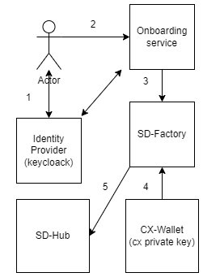

# <a id="introduction"></a>Catena-X Self-Description Hub

In Catena-X we provide self-descriptions for any participant of this data space.
The Self Descriptions are stored inside the Self Description Hub, but need to be
created first. Responsible for the creation of Self Descriptions is the Self
Discription-Factory component. This components gets all necessary parameters and
information from the Onboarding Tool, which prepares the data for the SD-Factory,
and uses the
[CX-Wallet](https://github.com/catenax-ng/product-core-managed-identity-wallets)
based on custodians to sign the Self Descriptions.

# Solution Strategy 

Here the flow of Self-Description creation is shown:



1. A user is authenticated in Identity Provider service on behalf of a company 
   and receives the authentication ticket.
2. User calls Onboarding Service with request for creating and publishing 
   SD-document. The service authenticates the user and prepare the data 
   SD-Factory needs for creating SD-document such as:  `company_number`, 
   `headquarter_country`, `legal_country`, `service_provider`, `sd_type` and 
   `bpn`. **Organization wallet of the company which runs the service shall 
   be available at this point of time as it signs the Verifiable Credential 
   with SD document. The wallet associated with the service shall be available 
   as well.**
3. Onboarding service (OS) calls SD-Factory for creating and publishing 
   SD-document passing this data as a parameter.  OS uses a credential with 
   a role allowing for this request (e.g. ROLE_SD_CREATOR, currently ROLE_access). 
   The credential for this operation is taken from ID Provider (keyclock).
4. SD-Factory creates a Verifiable Credential based on the information taken from
   OS and signs it with organization key. The organization is acting as an Issuer.
   The wallet ID of the service is used as Holder Id. The Custodian Wallet is used
   for this operation.
5. SD-Factory publishes the Verifiable Credential on the SD-Hub and saves it in MongoDB.

For the VC we have to provide valid JSON context where we have a reference to an object
from known ontology. This object carries the claims the SD-Factory signs. Currently,
this context is published as a JSON-LD document at
https://df2af0fe-d34a-4c48-abda-c9cdf5718b4a.mock.pstmn.io/sd-document-v0.1.jsonld

This context is going to be changed when corresponding vocabulary will be available in 
Trusted Framework. Currently, the vocabulary is defined in this file:
```json
{
  "@context": {
    "id": "@id",
    "type": "@type",
    "ctx" : "https://catena-x.net/selfdescription#",
    "SD-document": {
        "@id": "ctx:SD-document",
        "@context": {
            "company_number": {
                "@id": "ctx:company_number"
            },
            "headquarter_country": {
                "@id": "ctx:headquarter_country"
            },
            "legal_country": {
                "@id": "ctx:legal_country"
            },
            "service_provider": {
                "@id": "ctx:service_provider"
            },
            "sd_type": {
                "@id": "ctx:sd_type"
            },
            "bpn": {
                "@id": "ctx:bpn"
            }
        }
    },
    "company_number" : {
        "@id": "ctx:company_number",
        "@type": "https://schema.org/taxID"
    },
    "headquarter_country": {
        "@id": "ctx:headquarter_country",
        "@type": "https://schema.org/addressCountry"
    },
    "legal_country": {
        "@id": "ctx:legal_country",
        "@type": "https://schema.org/addressCountry"
    },
    "service_provider": {
        "@id": "ctx:service_provider",
        "@type": "https://schema.org/url"
    },
    "sd_type": {
        "@id": "ctx:sd_type",
        "@type": "http://www.w3.org/2000/01/rdf-schema#label"
    },
    "bpn": {
        "@id": "ctx:bpn",
        "@type": "https://schema.org/name"
    }
  }
}
```

# REST Interface

## The SD-Factory

The SD-Factory provides an interface for creating and deleting SD-documents. Both 
method are protected: the authorized user only can call it. Methods are protected 
with keycloak, which configuration parameters are given in `application.yml`.
The user roles for creating and deleting Self-Descriptions are specified in
`application.yml` as well.

```http request
POST /selfdescription
```
where body is
```json
{    
    "bpn" : "BPNL000000000000",
    "company_number" : "123456",
    "legal_country" : "DE",
    "headquarter_country" : "DE",
    "service_provider" : "http://test.example.com",
    "sd_type" : "connector",
    "holder" : "BPNL000000000000",
    "issuer" : "BPNL000000000000"
}
```
this call creates a Self-Description and publishes it in the Database.
The Self-Description in the format of Verifiable Credential is returned.

The fields are parameters of the Connector, holder is BPN or DID of
the Connector wallet and issuer is BPN or DID of the wallet which signs
the Verifiable Credential for this SD Document.

```http request
DELETE /selfdescription?id=...&id=...
```
removes Self Descriptions by their IDs.

SD-Factory is installed on integration environment and available 
at https://sdfactory.int.demo.catena-x.net/

The Swagger documentation for SD-Factory is available at
https://sdfactory.int.demo.catena-x.net/v3/api-docs as JSON and 
https://sdfactory.int.demo.catena-x.net/swagger-ui/index.html
in human-readable format. 

## SD-Hub
The self-description Hub provides a public interface to allow querying 
of self-descriptions. It also provides a method to retrieve Verifiable 
Credential for SD Document by its ID. All methods in this service are public.

```http request
GET /selfdescription/vc/{id}
```
returns Verifiable Credential by its ID

```http request
GET /selfdescription/by-params?id=...&company_number=...&headquarter_country=...&...
```
where `id`, `company_number`, `headquarter_country`, `legal_country`, `service_provider`,
`sd_type` and `bpn` are collections of parameters used as a filter to select the 
Verifiable Credentials kept in SD-Hub into the final document in format of 
Verifiable Presentation. The parameters need to match corresponding values in the 
selected SD-Documents The method returns Verifiable Presentation.
The SD-Documents which do not match the filter parameters are filtered. An empty
filter results the all documents be included to the Verifiable Presentation.

```http request
GET /selfdescription/by-id?id=...&id=...
```
returns the Verifiable Presentation where the list of the Verifiable Credentials 
to include is provided as a list. **Note:** here `id` is id of the VC to include,
not an id in Verifiable Credential subject. 

SD-Hub is installed on the integration environment and available 
at https://sdhub.int.demo.catena-x.net/ 

The Swagger documentation for SD-Hub is available at https://sdhub.int.demo.catena-x.net/v3/api-docs 
as JSON and https://sdhub.int.demo.catena-x.net/swagger-ui/index.html in human-readable format.

# Configuration
SD-Factory and SD-Hub are two microservices, each of them has its own configuration file.
The configuration property file is located under `resources` folder and is incorporated 
into the fat jar during build process. It can be customized before building if needed.
Or,the another one can be used as its location can be overridden:
```shell
java -jar myproject.jar --spring.config.location=file:./custom-config/
```
Here application.yaml will be searched in custom-config dir.

## Self-Description Factory Property file
An example of `application.yaml` for SD-Factory is given bellow:
```yaml
server:
  port: 8080
spring:
  data:
    mongodb:
      host: localhost
      port: 27017
      database: sdhub-mongo
keycloak:
  auth-server-url: https://centralidp.demo.catena-x.net/auth
  realm: CX-Central
  resource: Cl2-CX-Portal
  bearer-only: true
  use-resource-role-mappings: true
  principal-attribute: preferred_username
app:
  build:
    version: ^project.version^
  verifiableCredentials:
    durationDays: 90
    idPrefix: http://sdhub.int.demo.catena-x.net/
  custodianWallet:
    uri: https://custodian-dev.germanywestcentral.cloudapp.azure.com/api
    auth-server-url: https://catenaxdev003akssrv.germanywestcentral.cloudapp.azure.com/iamcentralidp/auth
    realm: CX-Central
    clientId: Client005-CustodianTest
    clientSecret: <client secret>
    username: <username>
    password: <password>
  security:
    createRole: add_self_descriptions
    deleteRole: remove_self_description
  db:
    sd:
      collectionName: selfdescription
```

Here `keycloak` section defines keycloak's parameters for authentication client requests.

`app.verifiableCredentials.durationDays` defines for how many days the VC is issued.

`app.verifiableCredentials.idPrefix` specifies prefix for VC identifiers. Internally the 
identifiers are represented as hexadecimal numbers, but need to accessible as URL. As SD-Hub
is responsible for serving the VCs, this parameter usually shall be set to the domain name
of the Hub.

`app.custodianWallet` contains parameters for accessing Custodian Wallet:
- `uri` is custodian Wallet url
- `auth-server-url`, `realm`, `clientId`, `clientSecret`, `username`, 
`password` - keycloak parameters for a user used for meking the calls to 
the Custodian Wallet. This user shall have enough rights to create 
Verifiable Credentials and Verifiable Presentations.

`app.security` - sets the roles a user must hold for creating and removing 
Self-Description to/from SD-Hub.

`app.db.sd.collectionName` sets MongoDB collection nname for storing Self-Descriptions

## Self-Description Hub Property file
SD-Hub has similar format for the configuration file. The difference is that SD-Hub
is a public service and does not require authentication of the client requests. Thus
keycloak section is omitted:
```yaml
server:
  port: 8081
spring:
  data:
    mongodb:
      host:  localhost
      port: 27017
      database: sdhub-mongo
app:
  build:
    version: ^project.version^
  sdhubId: BPNL000000000000
  custodianWallet:
    uri: https://custodian-dev.germanywestcentral.cloudapp.azure.com/api
    auth-server-url: https://catenaxdev003akssrv.germanywestcentral.cloudapp.azure.com/iamcentralidp/auth
    realm: CX-Central
    clientId: Client005-CustodianTest
    clientSecret: <client secret>
    username: <username>
    password: <password>
  db:
    sd:
      collectionName: selfdescription
```
As SD-Hub signs the Verifiable Presentation it needs to know which wallet shall to be used
to sign the Presentation. Parameter `sdhubId` specifies the ID of this wallet.

# Building
SD-Hub and SD-Factory use Maven for building process. To build a service from sources one
need to go to corresponding directory and trigger building process:
```shell
cd SDHub
./mvnw clean install
```
Then fat jar file can be found in `target` folder as well as in local Maven repository.
it can be ryn with this command:
```shell
java -jar target/sd-factory-1.0.0-SNAPSHOT.jar
```
for factory and
```shell
java -jar target/sd-hub-1.0.0-SNAPSHOT.jar
```
Please note the name of jar-file as it may differ if version is changed.

<a name="docker"></a>To build a Docker image one can use this command:
```shell
./mvnw spring-boot:build-image
```
A Docker image will be built and installed to the local repository.

# Testing
SD-Hub and SD-Factory can be fired up locally in Docker environment. Before that
the images need to be created as it is [described here](#docker). Pay attention 
to the image names as they may change if the version of the sources was bumped up,
but the `docker-compose.yml` has not been updated. Being in root directory of the
repository type this:
```shell
docker-compose up -d
```
Then you can call SD-Hub and SD-Factory API or see Swagger documentation by address
http://localhost:8080/swagger-ui/index.html for SD-hub and http://localhost:8081/swagger-ui/index.html
for SD-Factory.
