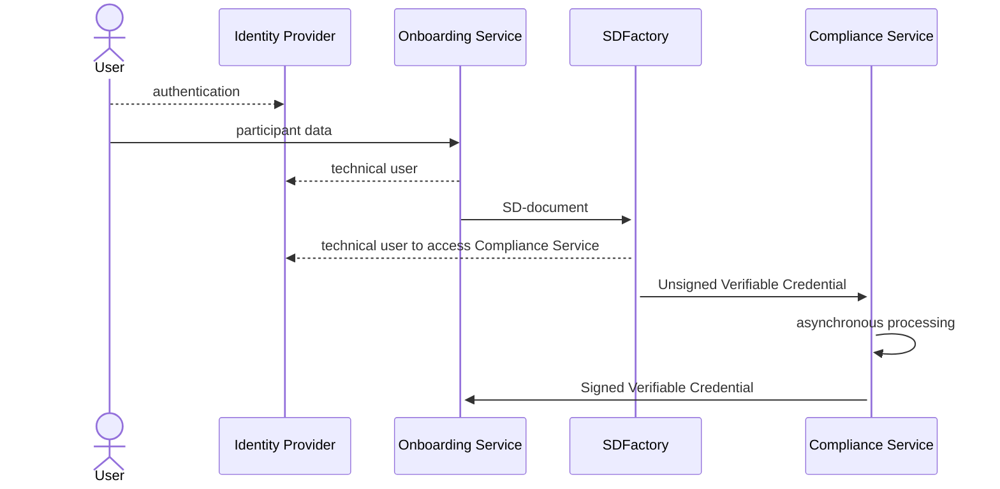

# <a id="introduction"></a>Self-Description Factory

A Self Description document (SD-document) is provided for any participant of this data 
space. The Self Descriptions are stored inside the Self Description Hub. Self-Description
Factory (SD-Factory) component is responsible for the creation of Self Descriptions. This 
component gets input data from the Onboarding Tool, which prepares the data for the SD-Factory,
creates a Verifiable Credential and passes the document to the
[Managed Identity Wallet](https://github.com/eclipse-tractusx/managed-identity-wallet)
based on the Custodian for the signature. The result is sent to the Compliance Service for
further processing.
Architecture communication and documentation are defined in [ARC42](docs/architecture/ARC42.md)


## Software Version

```shell
Software version: 2.1.23
Helm Chart version: 2.1.32
```


# Solution Strategy 

Here the flow of Self-Description creation is shown:



1. A user is authenticated in Identity Provider service on behalf of a company
   and receives the authentication ticket.
2. User calls On-boarding Service with request for creating and publishing
   SD-document. The service authenticates the user and prepare the data
   SD-Factory needs for creating SD-document. SDFactory takes document in a format,
   specified in OpenAPI document [Pre-22.4 schema, AKA 1.06]  and convert it to 
   [Trust Framework V.22.10]. Currently, these documents are supported by SD-Factory:
    - LegalParticipant;
    - ServiceOffering;
3. On-boarding service (OS) calls SD-Factory for creating SD-document passing this
   data as a parameter. OS uses a credential with a role allowing for this request
   (e.g. `add_self_descriptions`, the default role for SD-document creation). The
   credential for this operation is taken from Identity Provider (keycloak).
4. SD-Factory creates a Verifiable Credential based on the information taken from
   On-boarding Service
5. SD-Factory sends unsigned Verifiable Credential to the Compliance Service for further 
   (asynchronous) processing. Compliance Service is responsible for verification of the VC 
   and signing. In the end the Compliance Service sends Self-Description 
   document back to the On-boarding service endpoint. OS is responsible for storing and 
   publishing it. 

For the VC we have to provide valid JSON context where we have a reference to an object
from known ontology. This object carries the claims the SD-Factory signs. The document
is published on the github repository of the project. The vocabulary URL can be changed 
when will be provided by Trusted Framework. Currently, we support 
[a vocabulary for Version 22.10 of Trust Framework](src/main/resources/verifiablecredentials/sd-document-v2210.jsonld).

# REST Interface

The SD-Factory provides interfaces to create Verifiable Credential for one of mentioned documents.
Only the authorized user can call these interfaces. They are protected with keycloak. The configuration 
parameters are given in `application.yml`. The user role for creating Self-Descriptions is specified in 
`application.yml` as well.

To trigger creation of the SD-document one shall call the endpoint available by path :

`POST /api/rel3/selfdescription`

OpenAPI specification is given in [Pre-22.4 schema, AKA 1.06].

An example of the body for LegalParticipant is given bellow:

```json
{
  "type": "LegalParticipant",
  "holder": "BPNL000000000000",
  "name": "CAXSDUMMYCATENAZZ", 
  "externalId": "ID01234-123-4321",
  "registrationNumber": [
    {
      "type": "local",
      "value": "o12345678"
    }
  ],
  "headquarterAddress.countrySubdivisionCode": "DE-BY",
  "legalAddress.countrySubdivisionCode": "DE-NW"
}
```

The Self-Description in the format of Verifiable Credential is created. Here is an example of
Verifiable Credentials for LegalParticipant:

```json
{
    "@context": "https://www.w3.org/2018/credentials/v1",
    "type": "VerifiablePresentation",
    "verifiableCredential": [
        {
            "@context": [
                "https://www.w3.org/2018/credentials/v1",
                "https://registry.lab.gaia-x.eu/development/api/trusted-shape-registry/v1/shapes/jsonld/trustframework#"
            ],
            "type": [
                "VerifiableCredential"
            ],
            "id": "c4d47109-7a41-4440-a505-68ebb8239a91",
            "issuanceDate": "2025-02-10T12:05:59Z",
            "credentialSubject": {
                "id": "http://catena-x.net/bpn/BPNL000000000000",
                "type": "gx:LegalParticipant",
                "bpn": "BPNL000000000000",
                "gx:legalName": "Legal Participant Company Name",
                "gx:legalRegistrationNumber": {
                    "id": "775d0c0b-ce98-433f-a07f-f821f9501fd0"
                },
                "gx:headquarterAddress": {
                    "gx:countrySubdivisionCode": "DE-BY"
                },
                "gx:legalAddress": {
                    "gx:countrySubdivisionCode": "DE-NW"
                }
            }
        },
        {
            "@context": [
                "https://www.w3.org/2018/credentials/v1",
                "https://w3id.org/security/suites/jws-2020/v1"
            ],
            "type": [
                "VerifiableCredential"
            ],
            "id": "775d0c0b-ce98-433f-a07f-f821f9501fd0",
            "issuanceDate": "2025-02-10T12:05:59Z",
            "credentialSubject": {
                "@context": "https://registry.lab.gaia-x.eu/development/api/trusted-shape-registry/v1/shapes/jsonld/trustframework#",
                "type": "gx:legalRegistrationNumber",
                "id": "http://catena-x.net/bpn/BPNL000000000000",
                "gx:leiCode": "5299004XSA235235"
            }
        }
    ]
}
```

Then the Verifiable Credential is sent to the Compliance Service.

# Configuration
The configuration property file is located under `resources` folder and is incorporated 
into the fat jar during build process. It can be customized before building if needed.
Or,the another one can be used as its location can be overridden:
```shell
java -jar myproject.jar --spring.config.location=file:./custom-config/
```
Here application.yml will be searched in custom-config dir.

## Self-Description Factory Property file
An example of [application.yml](src/main/resources/application.yml) for SD-Factory is given bellow:
```yaml
server:
  port: 8080
  error:
    include-message: always
keycloak:
  resource:
    clientid: <CLIENTID>
spring:
  jackson:
    default-property-inclusion: non_null
  profiles:
     active: catena-x-ctx
  security:
    oauth2:
      resourceserver:
        jwt:
        #jwk-set-uri: https://<example.com>/auth/realms/<REALM>/protocol/openid-connect/certs
springdoc:
  api-docs:
    enabled: true
  swagger-ui:
    url: /SDFactoryApi-vRel3.yml
app:
  build:
    version: ^project.version^
  verifiableCredentials:
    durationDays: 90
    schema2210Url: <SCHEMA2210URL>
  usersDetails:
    clearingHouse:
    #uri: https://<example.com>/api/credentials
    #serverUrl: https://<example.com>/auth
    #realm: <REALM>
    #clientId: <CLIENTID>
    #clientSecret:
  security:
    createRole: add_self_descriptions
```

Here `keycloak` section defines keycloak's parameters for client requests authentication.

Section `spring.profiles` activates different modes. From functional point of view, the Factory acts as a converter,
transforming an input message to the output JSON and passes it to the Compliance Service. The actual converter is selected
by setting corresponding profile. Currently, two type of converters are supported. The old one is selected if profile
'catena-x-ctx' is selected. It was used from the the beginning and well tested. The second is activated when 'gaia-x-ctx'
profile is chosen. This converter generates JSON which shall be compatible with Gaia-X requirements, however it needs to
be aligned with other services/components.

`app.verifiableCredentials.durationDays` defines for how many days the VC is issued.

`schema2210Url` specify the JSON-LD vocabulary URL

`app.custodianWallet` contains parameters for accessing Custodian Wallet:
- `uri` is custodian Wallet url
- `auth-server-url`, `realm`, `clientId`, `clientSecret` are keycloak parameters for 
   a user which calls the Custodian Wallet. This user shall have enough rights to create 
   Verifiable Credentials and Verifiable Presentations.
`app.clearingHouse` contains authentication parameters for calling the Compliance Service.

`app.security` sets a role a user must have for creating Self-Description.

# Building
SD-Factory use Maven for building process. To build a service from sources one
need to go to corresponding directory and trigger building process:
```shell
cd SDFactory
./mvnw clean install
```
Then fat jar file can be found in `target` folder as well as in local Maven repository.
it can be run with this command:
```shell
java -jar target/sd-factory-2.0.0.jar
```
Please note the name of jar-file as it may differ if version is changed.

To build a Docker image one can use this command:
```shell
docker build .
```
A Docker image will be built and installed to the local repository.

# Testing
SD-Factory can be fired up locally in Docker environment. Before that the image needs
to be created. Do not forget to provide necessary configuration parameters in `application.yml`
for keycloak and the Custodian Wallet.

If `spring.profile` is set to `test` then the Factory does not send self-description to the Compliance Service, instead
it just prints it out along with service data like Compliance Service URL, authentication token (if any) and external ID. 

# Container images

This application provides container images for demonstration purposes. The base image used, to build this demo application image is eclipse-temurin:17-jdk-alpine

## Notice for Docker image

Docker Notice for this application can be find below:

 [DOCKER_NOTICE.md](DOCKER_NOTICE.md)

## Installation Steps

[INSTALL.md](INSTALL.md)

## API health check URL
We can check the health for SD Factory by using below URL:

- https://<example.com>/actuator/health

## License

Distributed under the Apache 2.0 License. See [LICENSE](LICENSE) for more information.

## Contact

For contacting regarding the project see [CONTACT](CONTACT.md)

[Pre-22.4 schema, AKA 1.06]: src/main/resources/static/SDFactoryApi-Tagus.yml
[Trust Framework]: https://gitlab.com/gaia-x/policy-rules-committee/trust-framework
[Trust Framework V.22.10]: https://gitlab.com/gaia-x/policy-rules-committee/trust-framework/-/tree/22.10

