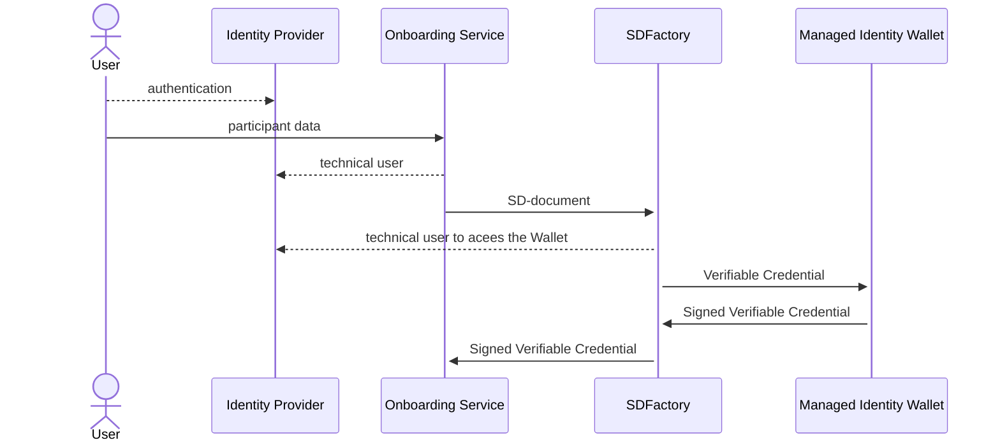

# <a id="introduction"></a>Self-Description Factory

In Catena-X we provide self-descriptions for any participant of this data space.
The Self Descriptions are stored inside the Self Description Hub. Self-Description 
Factory component is responsible for the creation of Self Descriptions. This component 
gets input data from the Onboarding Tool, which prepares the data for the SD-Factory,
creates a Verifiable Credential and passes the document to the
[Managed Identity Wallet](https://github.com/eclipse-tractusx/managed-identity-wallets)
based on the Custodian for the signature. The result is passed back to the requester.

# Solution Strategy 

Here the flow of Self-Description creation is shown:



1. A user is authenticated in Identity Provider service on behalf of a company
   and receives the authentication ticket.
2. User calls On-boarding Service with request for creating and publishing
   SD-document. The service authenticates the user and prepare the data
   SD-Factory needs for creating SD-document. The documents SD-Factory can 
   work with are defined in [Trust Framework]. SDFactory supports schema from different 
   versions of [Trust Framework] depending on the endpoint address. 
   Take a look at the section describing [REST interface](#REST Interface) for details. 
   Currently, these documents are supported by SD-Factory:
    - LegalPerson (API v1.0.6, [Trust Framework V.22.04], [Trust Framework V.22.10])
    - ServiceOffering (API v1.0.6, [Trust Framework V.22.04], [Trust Framework V.22.10])
    - PhysicalResource ([Trust Framework V.22.04], [Trust Framework V.22.10])
    - VirtualResource ([Trust Framework V.22.04], [Trust Framework V.22.10])
    - InstantiatedVirtualResource ([Trust Framework V.22.04], [Trust Framework V.22.10])

   **Organization wallet of the company which runs the service shall
   be available at this point of time as it signs the Verifiable Credential
   with SD document. The wallet associated with the service shall be available
   as well.**
3. On-boarding service (OS) calls SD-Factory for creating SD-document passing this
   data as a parameter. OS uses a credential with a role allowing for this request
   (e.g. `add_self_descriptions`, the default role for SD-document creation). The
   credential for this operation is taken from Identity Provider (keyclock).
4. SD-Factory creates a Verifiable Credential based on the information taken from
   OS and signs it with organization key. The organization is acting as an Issuer.
   The wallet ID of the service is used as Holder Id. The Custodian Wallet is used
   for this operation.
5. SD-Factory returns signed Verifiable Credential to the requester (On-boarding service),
   which is responsible for publishing it. 

For the VC we have to provide valid JSON context where we have a reference to an object
from known ontology. This object carries the claims the SD-Factory signs. The document
is published on the github repository of the project. The vocabulary URL can be changed 
when will be provided by Trusted Framework. Currently, three vocabularies are supported:
1. [Pre-22.4 schema, AKA 1.06](src/main/resources/verifiablecredentials.jsonld/sd-document-v1.0.6.jsonld).
2. [Version 22.04 of Trust Framework](src/main/resources/verifiablecredentials.jsonld/sd-document-v22.04.jsonld).
3. [Version 22.10 of Trust Framework](src/main/resources/verifiablecredentials.jsonld/sd-document-v22.10.jsonld).

# REST Interface

The SD-Factory provides interfaces to create Verifiable Credential for one of mentioned documents.
Only the authorized user can call these interfaces. They are protected with keycloak. The configuration 
parameters are given in `application.yml`.
The user role for creating Self-Descriptions is specified in `application.yml` as well.

Depending on the required version a SD-document goes to one of those endpoint to be converted to the 
signed Verifiable Credential:

1. `POST /api/1.0.6/selfdescription`
2. `POST /api/22.04/selfdescription`
3. `POST /api/22.10/selfdescription`

OpenAPI specification for each version is given there:

1. [Pre-22.4 schema, AKA 1.06](src/main/resources/static/SDFactoryApi-vRel3.yml).
2. [Version 22.04 of Trust Framework](src/main/resources/static/SDFactoryApi-v22.04.yml).
3. [Version 22.10 of Trust Framework](src/main/resources/static/SDFactoryApi-v22.10.yml).

An example of the body for LegalPerson from  22.04 specification is given bellow:

```json
{
  "type": "LegalPerson",
  "issuer": "CAXSDUMMYCATENAZZ",
  "registrationNumber": "o12345678",
  "headquarterAddress": {
    "country": "DE"
  },
  "legalAddress": {
    "country": "DE"
  },
  "leiCode": "20_digit_code",
  "parentOrganisation": [
    "https://parent.organisation1.org",
    "https://parent.organisation2.org"
  ],
  "subOrganisation": [
    "https://sub.organisation1.org",
    "https://sub.organisation2.org"
  ],
  "bpn": "BPNL000000000000"
}
```

The Self-Description in the format of Verifiable Credential is returned. Here is an example of
Verifiable Credentials for LegalPerson:

```json
{
  "@context": [
    "https://www.w3.org/2018/credentials/v1",
    "https://github.com/catenax-ng/tx-sd-factory/raw/main/src/main/resources/verifiablecredentials.jsonld/sd-document-v22.04.jsonld",
    "https://w3id.org/vc/status-list/2021/v1"
  ],
  "type": [
    "VerifiableCredential",
    "LegalPerson"
  ],
  "issuer": "did:sov:BEumURwPdXCobgbPYQZXge",
  "issuanceDate": "2022-11-23T12:02:41Z",
  "expirationDate": "2023-02-21T12:02:41Z",
  "credentialSubject": {
    "type": "LegalPerson",
    "registrationNumber": "o12345678",
    "headquarterAddress": {
      "country": "DE"
    },
    "legalAddress": {
      "country": "DE"
    },
    "leiCode": "20_digit_code",
    "parentOrganisation": [
      "https://parent.organisation1.org",
      "https://parent.organisation2.org"
    ],
    "subOrganisation": [
      "https://sub.organisation1.org",
      "https://sub.organisation2.org"
    ],
    "bpn": "BPNL000000000000",
    "id": "did:indy:idunion:test:P5TFvs9PQ6e6nMB18XVTJw"
  },
  "credentialStatus": {
    "id": "https://managed-identity-wallets.int.demo.catena-x.net/api/credentials/status/fe5da20d-35c1-4154-b764-1e7dc875ca1d#452",
    "type": "StatusList2021Entry",
    "statusPurpose": "revocation",
    "statusListIndex": "452",
    "statusListCredential": "https://managed-identity-wallets.int.demo.catena-x.net/api/credentials/status/fe5da20d-35c1-4154-b764-1e7dc875ca1d"
  },
  "proof": {
    "type": "Ed25519Signature2018",
    "created": "2022-11-23T12:02:43Z",
    "proofPurpose": "assertionMethod",
    "verificationMethod": "did:sov:BEumURwPdXCobgbPYQZXge#key-1",
    "jws": "eyJhbGciOiAiRWREU0EiLCAiYjY0IjogZmFsc2UsICJjcml0IjogWyJiNjQiXX0..KALYtsHMI62J0x3ILqkuOc8hu30YzBevanddWesaEd2j776fKZN5dvJBfUH_Lo7Q97jXhmZMiYt7HW7k-8duBA"
  }
}
```

# Configuration
The configuration property file is located under `resources` folder and is incorporated 
into the fat jar during build process. It can be customized before building if needed.
Or,the another one can be used as its location can be overridden:
```shell
java -jar myproject.jar --spring.config.location=file:./custom-config/
```
Here application.yml will be searched in custom-config dir.

## Self-Description Factory Property file
An example of [application.yml](src/main/resources/application.yml) for SD-Factory is given bellow:
```yaml
server:
  port: 8080
  error:
    include-message: always
keycloak:
  #auth-server-url: https://centralidp.int.demo.catena-x.net/auth
  #realm: CX-Central
  #resource: Cl2-CX-Portal
  bearer-only: true
  use-resource-role-mappings: true
  principal-attribute: preferred_username
spring:
  jackson:
    default-property-inclusion: non_null
springdoc:
  api-docs:
    enabled: false
  swagger-ui:
    urls:
      - url: /SDFactoryApi-v22.10.yml
        name: API-22.10
      - url: /SDFactoryApi-v22.04.yml
        name: API-22.04
      - url: /SDFactoryApi-vRel3.yml
        name: API-1.0.6
app:
  build:
    version: ^project.version^
  verifiableCredentials:
    durationDays: 90
    schema106Url: https://github.com/catenax-ng/tx-sd-factory/raw/all-versions/src/main/resources/verifiablecredentials.jsonld/sd-document-v1.0.6.jsonld
    schema2204Url: https://github.com/catenax-ng/tx-sd-factory/raw/all-versions/src/main/resources/verifiablecredentials.jsonld/sd-document-v22.04.jsonld
    schema2210Url: https://github.com/catenax-ng/tx-sd-factory/raw/all-versions/src/main/resources/verifiablecredentials.jsonld/sd-document-v22.10.jsonld
  custodianWallet:
    uri: https://managed-identity-wallets.int.demo.catena-x.net/api
    #auth-server-url: https://centralidp.int.demo.catena-x.net/auth
    realm: CX-Central
    #clientId: ${CLIENTID}
    #clientSecret: ${CLIENTSECRET}
  security:
    createRole: add_self_descriptions
```

Here `keycloak` section defines keycloak's parameters for client requests authentication.

`app.verifiableCredentials.durationDays` defines for how many days the VC is issued.

`schema106Url`,  `schema2204Url` and `schema2210Url` specify the JSON-LD vocabulary URLs for API 1.0.6 (pre-22.04), 
22.04 and 22.10 versions respectively.  

`app.custodianWallet` contains parameters for accessing Custodian Wallet:
- `uri` is custodian Wallet url
- `auth-server-url`, `realm`, `clientId`, `clientSecret` are keycloak parameters for 
   a user which calls the Custodian Wallet. This user shall have enough rights to create 
   Verifiable Credentials and Verifiable Presentations.

`app.security` sets a role a user must have for creating Self-Description.

# Building
SD-Factory use Maven for building process. To build a service from sources one
need to go to corresponding directory and trigger building process:
```shell
cd SDFactory
./mvnw clean install
```
Then fat jar file can be found in `target` folder as well as in local Maven repository.
it can be run with this command:
```shell
java -jar target/sd-factory-1.1.0.jar
```
Please note the name of jar-file as it may differ if version is changed.

<a name="docker"></a>To build a Docker image one can use this command:
```shell
docker build .
```
A Docker image will be built and installed to the local repository.

# Testing
SD-Factory can be fired up locally in Docker environment. Before that
the images need to be created as it is [described here](#docker). Do not forget
to provide necessary configuration parameters in application.yml for keycloak 
and the Custodian Wallet.

## Installation Steps:-

Helm charts are provided inside https://github.com/catenax-ng/tx-sd-factory

There are diffrent ways to do the installation

1. Using helm commands:-  

    a.) git clone https://github.com/catenax-ng/product-sd-hub.git  <br />
    b.) Modify values file according to your requirement.  <br />
    c.) You need to define the secrets as well in values.yaml
        secret:  <br />
          clientId: ""  -> Custodian wallet client id  <br />
          clientSecret: ""  -> Custodian wallet client secret  <br />
          authServerUrl: ""  ->  Keycloak URL   <br />
          realm: ""   -> Keycloak Realm  <br />
          resource: ""  ->  Keycloak Resource   <br />
          custodianWalletUri: "" -> Custodian wallet URI  <br /> 
    d.) These secrets should be defined in Hashicorp vault
    e.) Deploy in a kubernetes cluster  <br />
        helm install sdfactory charts/SDFactory/ -n NameSpace  <br />

2. Using ArgoCD. 

To see how to deploy an application on 'Hotel Budapest': 
[How to deploy](https://catenax-ng.github.io/docs/guides/ArgoCD/how-to-deploy-an-application)

[Trust Framework]: https://gitlab.com/gaia-x/policy-rules-committee/trust-framework
[Trust Framework V.22.04]: https://gitlab.com/gaia-x/policy-rules-committee/trust-framework/-/tree/22.04
[Trust Framework V.22.10]: https://gitlab.com/gaia-x/policy-rules-committee/trust-framework/-/tree/22.10

