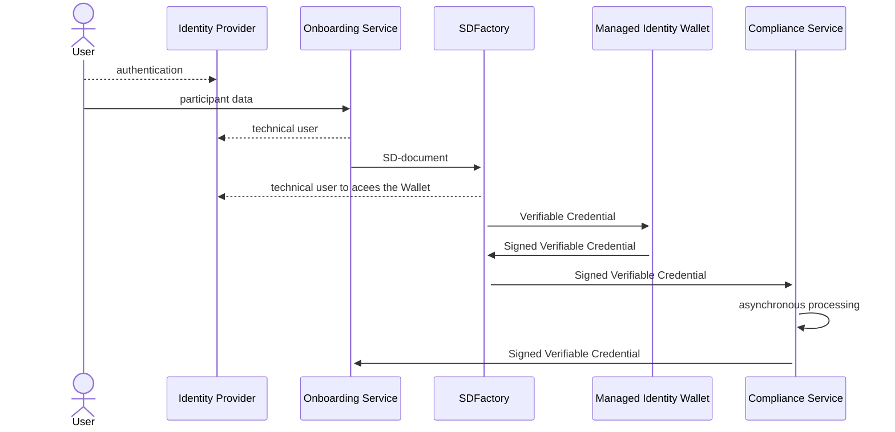

# <a id="introduction"></a>Self-Description Factory

A Self Description document (SD-document) is provided for any participant of this data 
space. The Self Descriptions are stored inside the Self Description Hub. Self-Description
Factory (SD-Factory) component is responsible for the creation of Self Descriptions. This 
component gets input data from the Onboarding Tool, which prepares the data for the SD-Factory,
creates a Verifiable Credential and passes the document to the
[Managed Identity Wallet](https://github.com/eclipse-tractusx/managed-identity-wallets)
based on the Custodian for the signature. The result is sent to the Compliance Service for
further processing.


## Software Version

```shell
Software version: 2.0.7
Helm Chart version: 2.0.8

```


# Solution Strategy 

Here the flow of Self-Description creation is shown:



1. A user is authenticated in Identity Provider service on behalf of a company
   and receives the authentication ticket.
2. User calls On-boarding Service with request for creating and publishing
   SD-document. The service authenticates the user and prepare the data
   SD-Factory needs for creating SD-document. SDFactory takes document in a format,
   specified in OpenAPI document [Pre-22.4 schema, AKA 1.06]  and convert it to 
   [Trust Framework V.22.10]. Currently, these documents are supported by SD-Factory:
    - LegalPerson;
    - ServiceOffering;
   **Organization wallet of the company running the service shall
   be available at this point of time as it signs the Verifiable Credential
   with SD document. The wallet associated with the service shall be available
   as well.**
3. On-boarding service (OS) calls SD-Factory for creating SD-document passing this
   data as a parameter. OS uses a credential with a role allowing for this request
   (e.g. `add_self_descriptions`, the default role for SD-document creation). The
   credential for this operation is taken from Identity Provider (keycloak).
4. SD-Factory creates a Verifiable Credential based on the information taken from
   OS and passes it to the Custodian Wallet to be signed with organization key. The 
   organization is acting as an Issuer. The wallet ID of the service is used as a Holder.
5. SD-Factory sends signed Verifiable Credential to the Compliance Service for further 
   (asynchronous) processing. In the end the Compliance Service sends Self-Description 
   document back to the On-boarding service endpoint. OS is responsible for storing and 
   publishing it. 

For the VC we have to provide valid JSON context where we have a reference to an object
from known ontology. This object carries the claims the SD-Factory signs. The document
is published on the github repository of the project. The vocabulary URL can be changed 
when will be provided by Trusted Framework. Currently, we support 
[a vocabulary for Version 22.10 of Trust Framework](src/main/resources/verifiablecredentials.jsonld/sd-document-v22.10.jsonld).

# REST Interface

The SD-Factory provides interfaces to create Verifiable Credential for one of mentioned documents.
Only the authorized user can call these interfaces. They are protected with keycloak. The configuration 
parameters are given in `application.yml`. The user role for creating Self-Descriptions is specified in 
`application.yml` as well.

To trigger creation of the SD-document one shall call the endpoint available by path :

`POST /api/rel3/selfdescription`

OpenAPI specification is given in [Pre-22.4 schema, AKA 1.06].

An example of the body for LegalPerson is given bellow:

```json
{
  "type": "LegalPerson",
  "holder": "BPNL000000000000",
  "issuer": "CAXSDUMMYCATENAZZ", 
  "externalId": "ID01234-123-4321",
  "registrationNumber": [
    {
      "type": "local",
      "value": "o12345678"
    }
  ],
  "headquarterAddress.country": "DE",
  "legalAddress.country": "DE",
  "bpn": "BPNL000000000000"
}
```

The Self-Description in the format of Verifiable Credential is created. Here is an example of
Verifiable Credentials for LegalPerson:

```json
{
  "@context": [
    "https://www.w3.org/2018/credentials/v1",
    "https://raw.githubusercontent.com/eclipse-tractusx/sd-factory/main/src/main/resources/verifiablecredentials.jsonld/sd-document-v22.10.jsonld",
    "https://w3id.org/vc/status-list/2021/v1"
  ],
  "type": [
    "VerifiableCredential",
    "LegalPerson"
  ],
  "issuer": "did:sov:XAZ71Ypzh3Da6Yzi1kjgZs",
  "issuanceDate": "2023-01-25T13:52:48Z",
  "expirationDate": "2023-04-25T13:52:48Z",
  "credentialSubject": {
    "bpn": "BPNL000000000000",
    "registrationNumber": [
      {
        "type": "local",
        "value": "o12345678"
      }
    ],
    "headquarterAddress": {
      "countryCode": "DE"
    },
    "type": "LegalPerson",
    "legalAddress": {
      "countryCode": "DE"
    },
    "id": "did:sov:2xcjN7LjnHGaPdZbbGqju5"
  },
  "credentialStatus": {
    "id": "https://managed-identity-wallets.int.demo.catena-x.net/api/credentials/status/7338ff60-dc18-47e2-9021-029e7db70bb2#36",
    "type": "StatusList2021Entry",
    "statusPurpose": "revocation",
    "statusListIndex": "36",
    "statusListCredential": "https://managed-identity-wallets.int.demo.catena-x.net/api/credentials/status/7338ff60-dc18-47e2-9021-029e7db70bb2"
  },
  "proof": {
    "type": "Ed25519Signature2018",
    "created": "2023-01-25T13:52:49Z",
    "proofPurpose": "assertionMethod",
    "verificationMethod": "did:sov:XAZ71Ypzh3Da6Yzi1kjgZs#key-1",
    "jws": "eyJhbGciOiAiRWREU0EiLCAiYjY0IjogZmFsc2UsICJjcml0IjogWyJiNjQiXX0..rdRVga4MQ-M_t2baOyo--FxaSHm9xPzxJ4QkUW53HMxD9E783WWtkfT4Oo8FYc7AYv5fpXrEiwIeCUrTFhgbDw"
  }
}
```

Then the Verifiable Credential is sent to the Compliance Service.

# Configuration
The configuration property file is located under `resources` folder and is incorporated 
into the fat jar during build process. It can be customized before building if needed.
Or,the another one can be used as its location can be overridden:
```shell
java -jar myproject.jar --spring.config.location=file:./custom-config/
```
Here application.yml will be searched in custom-config dir.

## Self-Description Factory Property file
An example of [application.yml](src/main/resources/application.yml) for SD-Factory is given bellow:
```yaml
server:
  port: 8080
  error:
    include-message: always
keycloak:
  resource:
    clientid: Cl2-CX-Portal
spring:
  jackson:
    default-property-inclusion: non_null
  security:
    oauth2:
      resourceserver:
        jwt:
        #jwk-set-uri: https://centralidp.int.demo.catena-x.net/auth/realms/CX-Central/protocol/openid-connect/certs
springdoc:
  api-docs:
    enabled: true
  swagger-ui:
    url: /SDFactoryApi-vRel3.yml
app:
  build:
    version: ^project.version^
  verifiableCredentials:
    durationDays: 90
    schema2210Url: https://github.com/catenax-ng/tx-sd-factory/raw/main/src/main/resources/verifiablecredentials.jsonld/sd-document-v22.10.jsonld
  usersDetails:
    custodianWallet:
    #uri: https://managed-identity-wallets.int.demo.catena-x.net/api
    #serverUrl: https://centralidp.int.demo.catena-x.net/auth
    #realm: CX-Central
    #clientId: sa-cl5-custodian-1
    #clientSecret:
    clearingHouse:
    #uri: https://dummy.dev.demo.catena-x.net/api/credentials
    #serverUrl: https://centralidp.int.demo.catena-x.net/auth
    #realm: CX-Central
    #clientId: sa-cl2-02
    #clientSecret:
  security:
    createRole: add_self_descriptions
```

Here `keycloak` section defines keycloak's parameters for client requests authentication.

`app.verifiableCredentials.durationDays` defines for how many days the VC is issued.

`schema2210Url` specify the JSON-LD vocabulary URL

`app.custodianWallet` contains parameters for accessing Custodian Wallet:
- `uri` is custodian Wallet url
- `auth-server-url`, `realm`, `clientId`, `clientSecret` are keycloak parameters for 
   a user which calls the Custodian Wallet. This user shall have enough rights to create 
   Verifiable Credentials and Verifiable Presentations.
`app.clearingHouse` contains authentication parameters for calling the Compliance Service.

`app.security` sets a role a user must have for creating Self-Description.

# Building
SD-Factory use Maven for building process. To build a service from sources one
need to go to corresponding directory and trigger building process:
```shell
cd SDFactory
./mvnw clean install
```
Then fat jar file can be found in `target` folder as well as in local Maven repository.
it can be run with this command:
```shell
java -jar target/sd-factory-2.0.0.jar
```
Please note the name of jar-file as it may differ if version is changed.

To build a Docker image one can use this command:
```shell
docker build .
```
A Docker image will be built and installed to the local repository.

# Testing
SD-Factory can be fired up locally in Docker environment. Before that the image needs
to be created. Do not forget to provide necessary configuration parameters in `application.yml`
for keycloak and the Custodian Wallet.

# Container images

This application provides container images for demonstration purposes. The base image used, to build this demo application image is eclipse-temurin:17-jdk-alpine

Docker Hub:

 - eclipse-temurin(https://hub.docker.com/_/eclipse-temurin)
 - 17-jdk-alpine(https://hub.docker.com/layers/library/eclipse-temurin/17.0.6_10-jdk-alpine/images/sha256-c093675e143dc8023fb218c144e06491154491a7965d0664a93f99ada5259ec7?context=explore)

Source:

 - temurin-build(https://github.com/adoptium/temurin-build)
 - temurin docker repo info(https://github.com/docker-library/repo-info/tree/master/repos/eclipse-temurin)

## Installation Steps

[INSTALL.md](INSTALL.md)

[Pre-22.4 schema, AKA 1.06]: src/main/resources/static/SDFactoryApi-vRel3.yml
[Trust Framework]: https://gitlab.com/gaia-x/policy-rules-committee/trust-framework
[Trust Framework V.22.10]: https://gitlab.com/gaia-x/policy-rules-committee/trust-framework/-/tree/22.10

