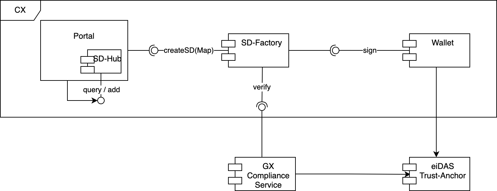
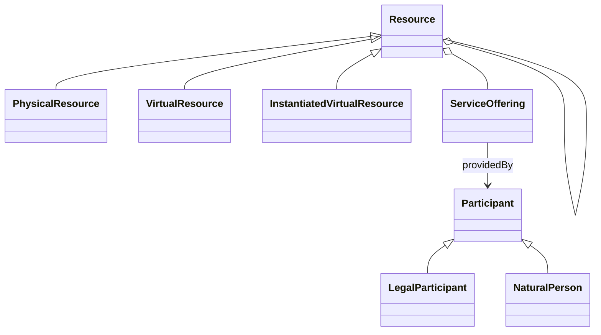
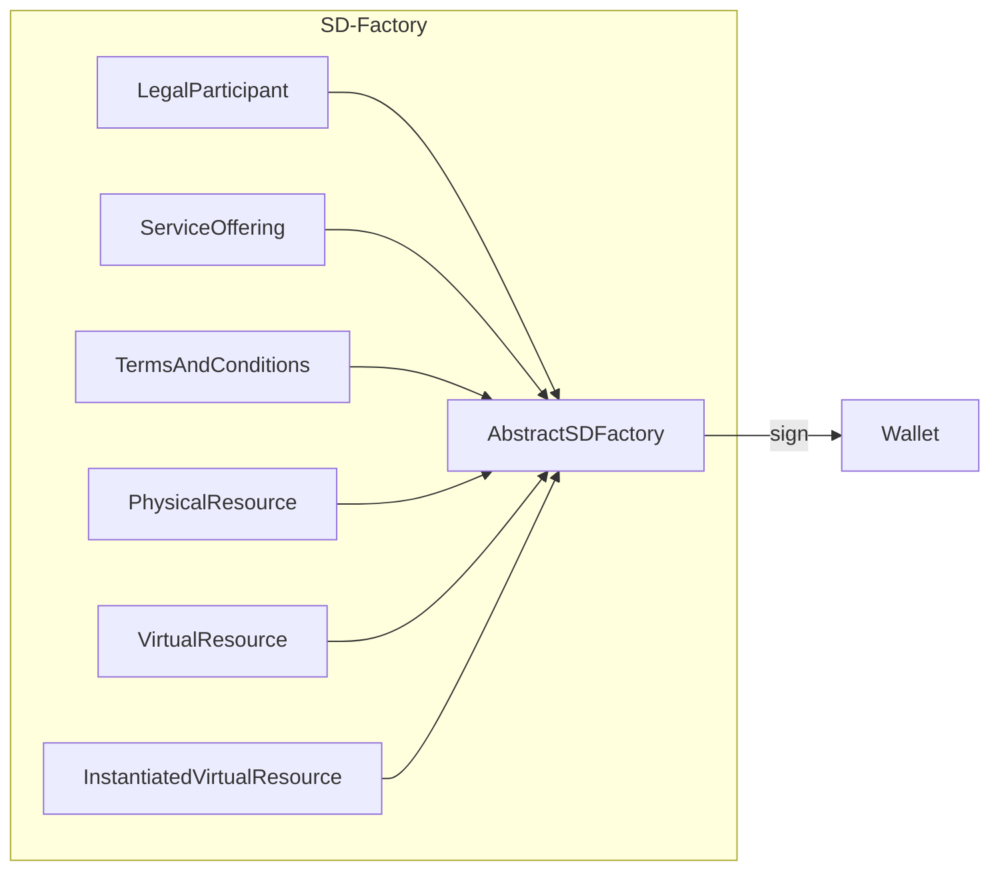
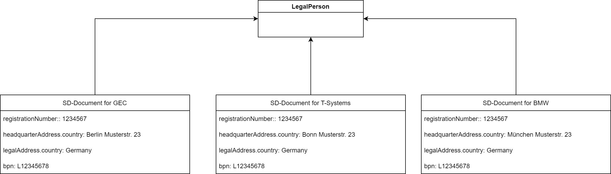
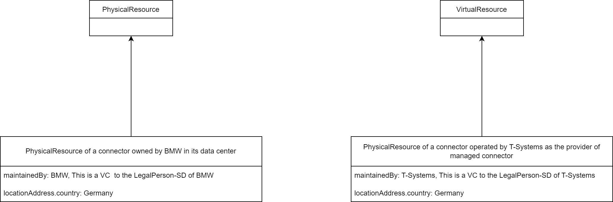
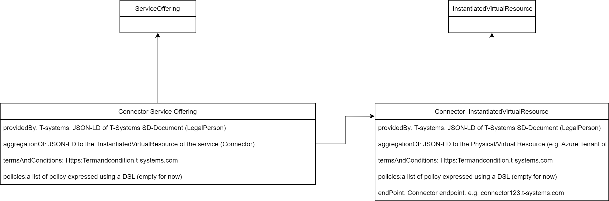
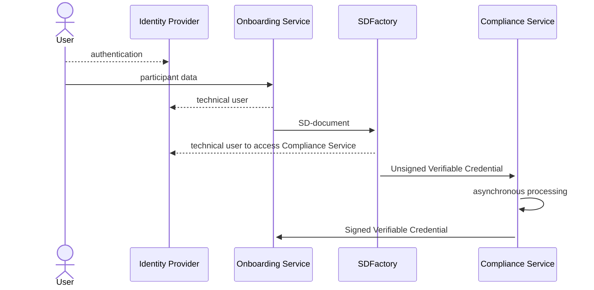

# ################################################################################
# Copyright (c) 2022,2023 T-Systems International GmbH
# Copyright (c) 2022,2023 Contributors to the Eclipse Foundation
#
# See the NOTICE file(s) distributed with this work for additional
# information regarding copyright ownership.
#
# This program and the accompanying materials are made available under the
# terms of the Apache License, Version 2.0 which is available at
# https://www.apache.org/licenses/LICENSE-2.0.
#
# Unless required by applicable law or agreed to in writing, software
# distributed under the License is distributed on an "AS IS" BASIS, WITHOUT
# WARRANTIES OR CONDITIONS OF ANY KIND, either express or implied. See the
# License for the specific language governing permissions and limitations
# under the License.
#
# SPDX-License-Identifier: Apache-2.0
# ##############################################################################

# Arc 42 Self Description Factory

## Introduction and Goals

SD-Factory creates a Verifiable Credential based on the information taken from Onboarding Service (OS) and requests
signature from CX-wallet.

The Self-Description Factory creates Self Description documents for entities of GAIA-X [Trust Framework].  

## Requirements Overview

### High Level Requirements for Release 1


*   Create Self-Descriptions formed on information from the Onboarding Service
*   Calls CX-Wallet to sign Self-Description with CatenaX key

### High Level Requirement for Release 2

*   Creation of LegalParticipant for each company
*   Creation of PhysicalResource for the place where the service (e.g. connector) will running
*   Creation of Service Offering and InstantiatedVirtualResource for each connector
*   Provide API interface exclusively for the Portal
*   Provide signed SD document
*   Store SD documents

### High Level Requirements for Release 3

*   validate compliance of created SD documents using GX Compliance Service
*   Trust-Anchor of wallet is an eiDAS trust anchor

### Non-functional requirements

*   The SD Factory will have to be: accessible, easy to use, secure, efficient etc.

### Quality Goals

| Priority | Quality-Goal | Scenario                                                                                       |
|----------|--------------|------------------------------------------------------------------------------------------------|
| 1        | Security     | Protecting API against unauthorized access. Protecting the Keys.                               |
| 1        | Integrity    | Authorized recipients/Users can not Delete and add SD-Document from/for other recipients/users |
| 2        | Reliability  | The microservices are available 99.9999%.                                                      |
| 2        | Ease-of-use  | The SD-Factory will provide ease-of-use API                                                    |

## Architecture Constraints

### Self Description Data Model

The data model of Gaia-X is not finally defined yet, but is a live document with permanent changes. The latest 
information are available [here](https://gaia-x.gitlab.io/policy-rules-committee/trust-framework/participant/#provider).
Therefore, it was aligned with Gaia-X that the Self Descriptions' claims contain a small set of properties such as

Version 0.1 (October 2021 as mentioned in a Workshop together with Pierre Gronlier)

*   service\_name: the service provider (Operating Company)
*   service\_provider: the service provider (Operating Company) 
*   product\_provider: the product provider (the company providing this service): For shared services this will be Catena-X or the operating company in the name of Catena-x. 
*   governance\_law\_country: the service provider

Version 1.0 (based on the [Trust-Framework])

* company\_number: Country’s registration number which identify one specific company.
* headquarter.country: Physical location in [ISO 3166-1](https://www.iso.org/iso-3166-country-codes.html)
  alpha2, alpha-3 or numeric format.
* legal.country: Legal location in [ISO 3166-1](https://www.iso.org/iso-3166-country-codes.html)
  alpha2, alpha-3 or numeric format.
* service.provider: a `provider`‘s URL which provide the service
* bpn: the business partner id

For Catena-X release 2.0 we aligned with GAIA-X to adhere to
[Trustframework v22.04](https://confluence.catena-x.net/download/attachments/25223149/Gaia-X-Trust-Framework-22.04.pdf?version=1&modificationDate=1658315527264&api=v2), 
thus providing self descriptions for

*   Legal person
*   Service offering
*   Data exchange connector service

**LegalParticipant**

* **registrationNumber**: Country’s registration number which identify one specific company.
* **headquarterAddress.country**: Physical location in [ISO 3166-1](https://www.iso.org/iso-3166-country-codes.html)
  alpha2, alpha-3 or numeric format.
* **legalAddress.country**: Legal location in [ISO 3166-1](https://www.iso.org/iso-3166-country-codes.html)
  alpha2, alpha-3 or numeric format.

additional attributes for Catena-X purpose

*   bpn: the business partner id

**ServiceOffering**

* **providedBy:** a resolvable link to the participant self-description providing the service (see SD LegalParticipant)
* **termsAndConditions**: a resolvable link to the Terms and Conditions applying to that service
* **policies**: a list of policy expressed using a DSL (Rego or ODRL)
* **aggregationOf:** (optional) a resolvable link to the resources self descriptions related to the service and that
  can exist independently of it.

**TermsAndConditions structure**

*   URL: a resolvable link to the document
*   hash: sha256 hash of the above document

For Catena-X release 3.0 we aligned with GAIA-X to adhere to
[Trust Framework V.22.10], providing self descriptions for

*   Legal person
*   Service offering


### GX-Compliance Service

GAIA-X will also provide a service to proof for compliant self descriptions 
([https://gitlab.com/gaia-x/lab/compliance/gx-compliance](https://gitlab.com/gaia-x/lab/compliance/gx-compliance)).


## System Scope and Context

The Portal provides the necessary information to the SD Factory in plain text format via
API. SD-Factory creates the JSON-LD document and provides it to the 
Compliance Service. After processing, Compliance Service sends Self-Description back to the Portal.

## Business Context



## Technical Context

The following pictures show the relevant conceptual model with the entities of interest. For organizations, we do not
have to consider Natural Persons, but only Legal Persons. Each of these entities does have some mandatory but also some
optional attributes.


  
To get them filled we provide a service factory for each of the entities. Hence, we have a subclassing hierarchy. 
The abstract instance provides the general feature to get things signed, either a part of the self-description or 
the whole self-description. In both cases, a string in JSON-LD format is passed to a wallet and gets signed by 
its private key and will be returned as String as signed JSON-LD.



The documents SD-Factory can
work with are defined in [Trust Framework]. SDFactory supports schema from different
versions of [Trust Framework] depending on the endpoint address.
Take a look at the section describing [REST interface](#REST Interface) for details.
Currently, these documents are supported by SD-Factory:
- LegalParticipant (API v1.0.6, [Trust Framework V.22.10])
- ServiceOffering (API v1.0.6, [Trust Framework V.22.10])
- PhysicalResource ([Trust Framework V.22.10])
- VirtualResource ([Trust Framework V.22.10])
- InstantiatedVirtualResource ([Trust Framework V.22.10])


## Solution Strategy

### The process for creating SD-Documents:

#### Step 1: Creation of LegalParticipant for each company
*   Each SME or Company has to have an SD-Document. This SD document has to be created during the on-boarding process.
*   Concretely, we have to create the LegalParticipant for those companies:
    *   SMEs,
    *   Enterprises,
    *   and Third-Party Provider

Example LegalParticipant



*   The SD-Document of a company's LegalParticipant is signed by the Catena-X Wallet.

#### Step 2: Creation of PhysicalResource for the place where the service (e.g. connector) will running

* Each service need a data center or cloud tenant where the service will be deployed. This is the Physical 
  resource of the service
* The PhysicalResource contains a list of Participant who maintaining the service and the location (country)

Example PhysicalResource:



The Physical Resource is created by the operator of the service (connector). The operator will use his wallet 
to sign this SD-Document.

#### Step 3: Creation of Service Offering and InstantiatedVirtualResource for each connector:

*   Pre assumptions:
    *   SD-Document: LegalParticipant of connector operator is already existing
    *   SD-Document: PhsicalResource of the Connector is already existing
*   creation of InstantiatedVirtualResource for each connector
*   creation of ServiceOffering for each connector



*   The SD-Document of the connector will be signed by the Company Wallet (e.g. T-Systems wallet).

## REST Interface

The SD-Factory provides interfaces to create Verifiable Credential for one of mentioned documents.
Only the authorized user can call these interfaces. They are protected with keycloak. The configuration
parameters are given in `application.yml`.
The user role for creating Self-Descriptions is specified in `application.yml` as well

To trigger creation of the SD-document one shall call the endpoint available by path :

`POST /api/rel3/selfdescription`

OpenAPI specification is given there:

[Pre-22.4 schema, AKA 1.06](../src/main/resources/static/SDFactoryApi-vRel3.yml).

An example of the body for LegalParticipant is given bellow:

```json
{
  "type": "LegalParticipant",
  "holder": "BPNL000000000000",
  "issuer": "CAXSDUMMYCATENAZZ",
  "registrationNumber": [
    {
      "type": "local",
      "value": "o12345678"
    }
  ],
  "headquarterAddress.country": "DE",
  "legalAddress.country": "DE",
  "bpn": "BPNL000000000000"
}
```

The Self-Description in the format of Verifiable Credential is created. Here is an example of
Verifiable Credentials for LegalParticipant:

```json
{
  "@context": [
    "https://www.w3.org/2018/credentials/v1",
    "https://f1c82785-5598-41c7-a083-01a8e1a80e19.mock.pstmn.io/ctxsd"
  ],
  "type": [
    "VerifiableCredential"
  ],
  "id": "5096f9c2-24fd-43c5-9d50-e43a409ebb33",
  "issuanceDate": "2023-07-26T17:07:31Z",
  "expirationDate": "2023-10-24T17:07:31Z",
  "credentialSubject": {
    "bpn": "BPNL000000000000",
    "registrationNumber": [
      {
        "type": "local",
        "value": "o12345678"
      }
    ],
    "headquarterAddress": {
      "countryCode": "DE"
    },
    "type": "LegalParticipant",
    "legalAddress": {
      "countryCode": "DE"
    }
  },
  "issuer": "CAXSDUMMYCATENAZZ"
}
```    

## SD-Documents for Release 2:

In agreement with Portal, we will only create the LegalParticipant SD-Document for CX-Participants and ServiceOffering for Connector

**CX-Release 2.0 (to be discussed with Portal-Team whether this reduces the amount of work or not for first step)**

> Proof, whether SD-Hub is able to provide a resolvable link to a registered SD artifact, e.g like _**[https://sdhub.catena-x.de/sd?bpn=xyz](https://sdhub.catena-x.de/sd?bpn=xyz)**_
>
> If this is possible, everything is fine and in the dialog this resolvable link had to be provided.
>
> If this is not possible, wenn instead of providing the link, we had to provide the data separated by semicolons for each attribute provided within the linked SD artifact.
>
> Example for this modified linking:
>
> Sample data for ServiceOffering:
> 
> instead of   
> providedBy="_**[https://sdhub.catena-x.de/sd?bpn=xyz](https://sdhub.catena-x.de/sd?bpn=xyz)**_"  
we send  
providedBy="registrationNumber="123456";headquarterAddress.country="DE";legalAddress.country="DE";bpn="CAXSDUMMYCATENAZZ";issuer="CAXSDUMMYCATENAZZ";holder="CAXSDUMMYCATENAZZ""

  
Responses:

| code | description                                      |
|------|--------------------------------------------------|
| 201  | A verifiable Credential was created successfully |
| 401  | Unauthorized                                     |
| 403  | Access is forbidden                              |

## Building Block View


## Runtime View



Here the flow of Self-Description creation is shown:

1. A user is authenticated in Identity Provider service on behalf of a company
   and receives the authentication ticket.
2. User calls On-boarding Service with request for creating and publishing
   SD-document. The service authenticates the user and prepare the data
   SD-Factory needs for creating SD-document. SDFactory takes document in a format,
   specified in OpenAPI document [Pre-22.4 schema, AKA 1.06]  and convert it to
   [Trust Framework V.22.10]. Currently, these documents are supported by SD-Factory:
    - LegalParticipant;
    - ServiceOffering;
3. On-boarding service (OS) calls SD-Factory for creating SD-document passing this
   data as a parameter. OS uses a credential with a role allowing for this request
   (e.g. `add_self_descriptions`, the default role for SD-document creation). The
   credential for this operation is taken from Identity Provider (keycloak).
4. SD-Factory creates a Verifiable Credential based on the information taken from
   On-boarding Service
5. SD-Factory sends unsigned Verifiable Credential to the Compliance Service for further
   (asynchronous) processing. Compliance Service is responsible for verification of the VC
   and signing. In the end the Compliance Service sends Self-Description
   document back to the On-boarding service endpoint. OS is responsible for storing and
   publishing it.

## Deployment View

In Catena-X we use [ARGO-CD](https://confluence.catena-x.net/display/ARTI/ArgoCD+deployment+tool) for deployment

[README.md](https://github.com/catenax-ng/tx-sd-factory/blob/main/README.md) describe the deployment process

## Quality Requirements

[See Quality Gates 4](https://confluence.catena-x.net/pages/viewpage.action?pageId=55011187&src=contextnavpagetreemode)

## Glossary

| Term                                                                                                     | Description                                                                                                                                                                                                                                                                                                                                                 |
|----------------------------------------------------------------------------------------------------------|-------------------------------------------------------------------------------------------------------------------------------------------------------------------------------------------------------------------------------------------------------------------------------------------------------------------------------------------------------------|
| Gaia-X                                                                                                   | Gaia-X represents the next generation of data infrastructure ecosystem: an open, transparent, and secure digital ecosystem, where data and services can be made available, collated and shared in an environment of trust. ([more](https://gaia-x.eu/sites/default/files/2021-10/Gaia-X%20Factsheet.pdf))                                                   |
| Catalogue                                                                                                | A Catalogue presents a list of available Service Offerings. Catalogues are the main building blocks for the publication and discovery of Self-Descriptions for Service Offerings by the Participants. ([more](https://gaia-x.eu/sites/default/files/2022-01/Gaia-X_Architecture_Document_2112.pdf))                                                         |
| (Catena-X Data Space)                                                                                    | A Data Space is a virtual data integration concept defined as a set of participants and a set of relationships among them, where participants provide their data resources and computing services. ([more](https://gaia-x.eu/sites/default/files/2022-01/Gaia-X_Architecture_Document_2112.pdf))                                                            |
| Catena-X Portal / Onboarding Process                                                                     | The portal is used for the registration/onboarding process in Catena-X and includes the login, user management and the initial registration.                                                                                                                                                                                                                |
| Claim                                                                                                    | An assertion made about a subject. ([more](https://www.w3.org/TR/vc-data-model/))                                                                                                                                                                                                                                                                           |
| [Custodian Wallet](https://confluence.catena-x.net/display/CORE/Registration-Service) / Catena-X wallet  | The Custodian Wallet interface is a cross product interface which is used to share the company name as well as the company bpn to the custodian service. The service is using those data to create a new wallet for the company. The wallet will hold the company name and bpn. ([more](https://confluence.catena-x.net/display/CORE/Registration-Service)) | 
| Decentralized Identifier (DID)                                                                           | Decentralized Identifiers are a new type of identifiers that enables verifiable, decentralized digital identity. ([more](https://www.w3.org/TR/did-core/))                                                                                                                                                                                                  |
| Federated Services                                                                                       | Federation Services are services required for the operational implementation of a Gaia-X Data Ecosystem. ([more](https://gaia-x.eu/sites/default/files/2022-01/Gaia-X_Architecture_Document_2112.pdf))                                                                                                                                                      |
| Federation                                                                                               | A Federation refers to a loose set of interacting actors that directly or indirectly consume, produce, or provide resources. ([more](https://gaia-x.eu/sites/default/files/2022-01/Gaia-X_Architecture_Document_2112.pdf))                                                                                                                                  |
| Holder                                                                                                   | Is the user that holds the verifiable credentials. ([more](https://www.w3.org/TR/vc-data-model/))                                                                                                                                                                                                                                                           |
| Issuer                                                                                                   | Is an instance that can issue verifiable credentials. ([more](https://www.w3.org/TR/vc-data-model/))                                                                                                                                                                                                                                                        |
| Keycloak                                                                                                 | Keycloack is an open-source Identity Management and Access management solution that allows Single Sign-On. ([more](https://www.keycloak.org/))                                                                                                                                                                                                              |
| Self-Description                                                                                         | A machine-readable File (json-lD) that contains description about Participants and Services.                                                                                                                                                                                                                                                                |
| [Self-Description Factory](https://confluence.catena-x.net/display/ARTI/ARC42-+Self+Description+Factory) | SD-Factory creates a Verifiable Credential based on the information taken from OS, unlocks Private Key from CX-wallet and signs it with Catena-X key. ([more](https://confluence.catena-x.net/display/ARTI/ARC42-+Self+Description+Factory))                                                                                                                |
| Self-Description Graph                                                                                   | The Self-Description Graph contains the information imported from the Self-Descriptions that are known to the Catalogue and have an “active” lifecycle state. ([more](https://gaia-x.eu/sites/default/files/2022-01/Gaia-X_Architecture_Document_2112.pdf))                                                                                                 |
| [Self-Description Hub](https://confluence.catena-x.net/display/ARTI/Self+Description+Hub)                | The Self-Description Hub's (SD Hub) store Self Descriptions in order to provide a flat catalogue of SDs.([more](https://confluence.catena-x.net/display/ARTI/Self+Description+Hub))                                                                                                                                                                         |
| [Self-Description Validator](https://confluence.catena-x.net/display/ARTI/ARC42-+Self+Description+Hub)   | The Self-Description validator is provided by Gaia-X. With that any Self Descriptions can be checked against an instance of the validator. ([more](https://confluence.catena-x.net/display/ARTI/ARC42-+Self+Description+Hub))                                                                                                                               |
| (Verifiable) Credential                                                                                  | A set of one or more Claims made and asserted by an issuer. ([more](https://www.w3.org/TR/vc-data-model/))                                                                                                                                                                                                                                                  |
| Verifiable Presentation                                                                                  | The expression of a subset of one's persona is called a verifiable presentation. ([more](https://www.w3.org/TR/vc-data-model/))                                                                                                                                                                                                                             |
| Verifier                                                                                                 | Is an instance that verifies the verifiable credentials of the holder. ([more](https://www.w3.org/TR/vc-data-model/))                                                                                                                                                                                                                                       |

## Links:

* [Gaia-X Architecture Document 21-09-2021](https://www.gaia-x.eu/sites/default/files/2021-10/Gaia-X_Architecture_Document_2109.pdf) 
* [Self Description](https://confluence.catena-x.net/display/ARTI/Self+Description)
* [https://gitlab.com/gaia-x/gaia-x-community/gaia-x-self-descriptions](https://gitlab.com/gaia-x/gaia-x-community/gaia-x-self-descriptions) (Note that this repository is private for Participants in the Gaia-X Self Description Working Group)
* [https://www.w3.org/TR/vc-data-model/](https://www.w3.org/TR/vc-data-model/#core-data-model)
* [https://github.com/WebOfTrustInfo/rwot9-prague/blob/master/topics-and-advance-readings/X.509-DID-Method.md](https://github.com/WebOfTrustInfo/rwot9-prague/blob/master/topics-and-advance-readings/X.509-DID-Method.md)
* [https://gaia-x.gitlab.io/policy-rules-committee/trust-framework/](https://gaia-x.gitlab.io/policy-rules-committee/trust-framework/)
* [https://github.com/boschresearch/gx-ssi-demonstrator](https://github.com/boschresearch/gx-ssi-demonstrator)
* [https://gitlab.com/gaia-x/lab/compliance/gaia-x-vc-issuer](https://gitlab.com/gaia-x/lab/compliance/gaia-x-vc-issuer)
* [https://gitlab.com/gaia-x/gaia-x-community/gaia-x-self-descriptions/-/tree/master/documentation/sd-tutorial](https://gitlab.com/gaia-x/gaia-x-community/gaia-x-self-descriptions/-/tree/master/documentation/sd-tutorial)

[Trust Framework]: https://gitlab.com/gaia-x/policy-rules-committee/trust-framework
[Trust Framework V.22.04]: https://gitlab.com/gaia-x/policy-rules-committee/trust-framework/-/tree/22.04
[Trust Framework V.22.10]: https://gitlab.com/gaia-x/policy-rules-committee/trust-framework/-/tree/22.10
